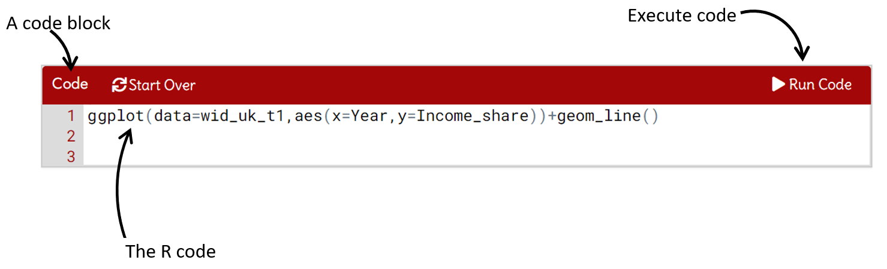
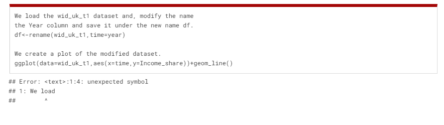
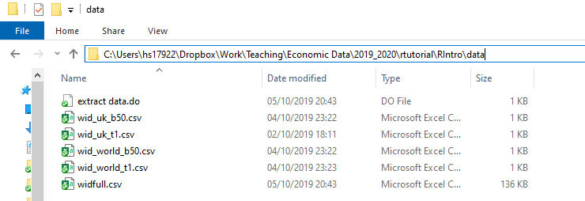

```{r setup, include=FALSE}
require("learnr")
#require(tidyverse)
require("dplyr")
require("ggplot2")
require("tidyr")
require("readr")
require("shinythemes")
require("aewr")
require("artyfarty")
require("emo")
require("ggthemes")
require("gghighlight")

knitr::opts_chunk$set(echo = FALSE,cache=FALSE)
```


<!-- INTRODUCTION START -->
## Welcome

#### Hi!

Welcome to this tutorial and to the R world. In this tutorial you will learn about loading, processing, and visualising data in R. The tutorial is designed for economics students at the University of Bristol, but everyone is welcome to use it.

#### How it works 

The tutorial is organised in 10 lectures with code examples, quizzes, and interactive code blocks. You can identify these elements by the following symbols:

`r emo::ji("nerd_face")` **Code example**

`r emo::ji("thinking")` **Quizzes**

`r emo::ji("woman_technologist")` **Code block**


The code blocks are interactive blocks of R code. You can and should change the R code and click "Run Code" to see what happens when you use this code in R. 

```{r , echo=FALSE, fig.cap=" ", out.width = '75%',fig.align='center'}

```

Most of the code blocks are complete and ready to run. But some blocks are incomplete and waiting for you to complete them. Incomplete code blocks typically  include a "hint" button to help you get started.


Have fun with the tutorial. I hope you'll enjoy it and learn some R.

Hans H. Sievertsen (November, 2020)


<!-- LECTURE 1 START -->
## 1 Our first R chart

*In this lecture we create our first chart using R.*
  
The following   block contains our first line of R code. Click the *Run Code* button on the right and let's see what happens.

`r emo::ji("woman_technologist")` **Code block: our first R chart** 
```{r ch1-chart1, exercise=TRUE,  warning=FALSE, message=FALSE, out.width=500,fig.align="center"}
ggplot(data=wid_uk_t1,aes(x=Year,y=Income_share))+geom_line()

```

You should now see your first R chart. Congratulations! 

But how did that happen? Let's have a closer look at the R code. 


* We start by calling the function named `ggplot`. We can recognize that it is a function because it has parenthesis `()` at the end of the name.

* By writing `ggplot()`, we simply  tell R to create a chart.

* In the parentheses of the ggplot function we include  `data=wid_uk_t1`. This tells R use the data called `wid_uk_t1` to create the chart. 

* We also add `aes(x=Year,y=Income_share)` to the `ggplot( )` function. This tells R to use the variable <tt>Year</tt> on the x-axis and the variable  <tt>Income_share</tt> on the y-axis in our chart.

* The `aes` in `aes()` is short for aesthetics and  refers to the  visual characteristics of our chart.

Let's try just to run just the code we discussed so far in the following code block:

`r emo::ji("woman_technologist")` **Code block: ggplot()** 
```{r ch1-chart2, exercise=TRUE,  warning=FALSE, message=FALSE, out.width=500,fig.align="center"}
ggplot(data=wid_uk_t1,aes(x=Year,y=Income_share))

```

Oh. That is a bit disappointing. We just get a gray area and no line chart. But we already notice that the axes are as expected. The x-axis (the horizontal axis) has a title *Year*. That is because we told R to use the variable 
<tt>Year</tt>  from the dataset called <tt>wid_uk_t1</tt>   on the x-axis. We also see tick marks and tick labels on the x-axis. Likewise for the y-axis (the vertical axis). Here we also have a title, tick marks and labels. 

But why don't we have any line yet? That is because we need to tell R what to do with the data. So far we've only told R to create a chart object using a specific dataset and the variables to use on each axis. 

We haven't told R anything about what type of chart to create. By writing `+geom_line()` we tell R to **add** (that is why we use a `+`) a line chart to the chart object. This completes our first code.  Now it's your turn. Try to add `+geom_line()` in the code block below and click *Run Code* (you can get some help by clicking on *Hint* or you can simply look at your first R line above).

`r emo::ji("woman_technologist")` **Code block: geom_line()** 

```{r ch1-chart3, exercise=TRUE,  warning=FALSE, message=FALSE, out.width=500,fig.align="center"}
ggplot(data=wid_uk_t1,aes(x=Year,y=Income_share))

```
```{r  ch1-chart3-hint-1}
ggplot(data=wid_uk_t1,aes(x=Year,y=Income_share))+geom_line()
```

You were hopefully able to complete the code and generate the line chart again. Great!  Now, what if we wanted to add some points (also called markers or scatters) to the line. How do you think we could achieve it? Let's try with a quiz first. You will have to guess the answer, because we haven't told you how to create a chart with points, yet. But maybe you can guess it:

`r emo::ji("thinking")` 
```{r ss}
quiz(
question("How do we add points to our chart?",
answer("We add the code `+geom_point()`.", correct = TRUE),
answer("We add the code `+geom_area()`."),
answer("We add the code `+geom_bar(stat='identity')`.")

))
```

You can implement the right answer in the code block below. The hints will guide you in the right direction. We also recommend that you try to see what happens if you implement the wrong answers. 

`r emo::ji("woman_technologist")` **Code block: geom_point()**
```{r ch1-chart4, exercise=TRUE,  warning=FALSE, message=FALSE}
ggplot(data=wid_uk_t1,aes(x=Year,y=Income_share))

```
```{r  ch1-chart4-hint-1}
ggplot(data=wid_uk_t1,aes(x=Year,y=Income_share))+geom_line()
```
```{r  ch1-chart4-hint-2}
ggplot(data=wid_uk_t1,aes(x=Year,y=Income_share))+geom_line()+geom_point()
```

Why did I ask you a question about something we haven't covered yet? To show you that R (and programming in general) is very logical. We can often guess what a function will do based on its name! 
  
Great. We've now completed our first lecture. In this lecture we've covered:
  
* Creating a chart with the `ggplot()` function in R
* Specifying the data to be used in the chart using the `data=` command. 
* Specifying the variable to be used on the x-axis and the variable to be used on the y-axis using `aes(x=..,y=)`.
* Adding elements to our chart using `+`.
* Adding a line chart to our chart using `geom_line()`.
* Adding points to our chart using `geom_point()`.

Congratulations if all these topics are familiar to you know. You've already covered a lot of ground. If not, try to read the page again or send your question to Hans. 

Let's move on to lecture 2. 

<!-- LECTURE 2 START -->

## 2 Polishing our chart

*In this lecture we'll polish the chart we created in lecture 1.*


### 2.1 Adding titles and labels

Let's have another look  at the chart we created in lecture 1:

`r emo::ji("nerd_face")` **Code example: our first R chart**

```{r , warning=FALSE, include=TRUE, echo=TRUE, message=FALSE, out.width=500,fig.align="center"}
ggplot(data=wid_uk_t1,aes(x=Year,y=Income_share))+geom_line()

```

The chart is actually looks quite alright. One of the benefits of R and the `ggplot()` approach we use to create chart is that the default design is decent. However, to make the chart self-explanatory we need to add a few elements. Specifically, we should add:

1. A title. In the current version we have no idea what country this is for.
2. The data source.
3. Information about the units used on the y-axis. 


Let's start with the title. The data is for the United Kingdom and it is showing the share of national income that goes to the top 1 percent. We therefore want to include a title saying "Income share for the United Kingdom".  We can achieve this by adding  `labs(title="Top 1% income share in the United Kingdom")` to our chart. Here `labs` is short for "labels" and this function can include all sorts of labels. But let's start with the title. The code block below is ready to run. You don't need to add anything. You can simply click "run code" to see what happens when we add `labs()` to our chart. Notice that the code is spread out on several lines. This is done to make it easier to read!


`r emo::ji("woman_technologist")`  **Code block: adding a title**
```{r ch2-chart2, exercise=TRUE,  warning=FALSE, message=FALSE, out.width=500,fig.align="center"}
ggplot(data=wid_uk_t1,aes(x=Year,y=Income_share))+
   geom_line()+
   labs(title="Top 1% income share in the United Kingdom")

```

Let's now also update the axes titles and the data sources. We can do all this using the `labs()` function. The x-axis title is specified with `x=...`, the y axis title with `y=...` and we can add table notes using `caption=...`. Let's try to add `title="Top 1% income share in the United Kingdom",x="Year"`, `y="Income share (rate)"`,`caption="Data source: The World Inequality Database,")` to our chart. I've already added it to the following chart, so you just have to click "run code". 

`r emo::ji("woman_technologist")` **Code block: adding axis titles**
```{r ch2-chart3, exercise=TRUE,  warning=FALSE, message=FALSE, out.width=500,fig.align="center"}
ggplot(data=wid_uk_t1,aes(x=Year,y=Income_share))+
   geom_line()
   +labs(title="Top 1% income share in the United Kingdom",
        x="Year",
        y="Income share (rate)",
        caption="Data source: World Inequality Database")

```


On no, we don't get a chart, but just a message saying:

>invalid argument to unary operator 

This is an error message. Our code is an instruction to the computer on what to do. Just like clicking on an icon with a mouse. If we use our mouse and attempt to click on an icon but don't hit the icon, the computer will not react as desired. This is because the computer doesn't know what we want to achieve. It cannot and should not guess. The same happens with code. We have to be precise and use the "syntax" correctly. The syntax is like a set of rules for the programming language. A bit like grammar in your normal English, Spanish or German. If we don't use the rules of the R language, R and thereby the computer, will not understand what we mean. R will then not return what we expect, but instead, return an error message like the above.

A major challenge in learning to use R (and programming in general) is that error messages often are uninformative. what does "invalid argument to unary operator" mean? In the example above, the error is simply that the `+` sign is at the beginning of the third line instead of at the end of the second line. 


Try to remove the `+` at the beginning of the third line and add it to the end of the second line (check also the hint) and see if you can get the code to work.

`r emo::ji("woman_technologist")` **Code block: fixing the coding error**
```{r ch2-chart3b, exercise=TRUE,  warning=FALSE, message=FALSE, out.width=500,fig.align="center"}
ggplot(data=wid_uk_t1,aes(x=Year,y=Income_share))+
   geom_line()
   +labs(title="Top 1% income share in the United Kingdom",
        x="Year",
        y="Income share (rate)",
        caption="Data source: World Inequality Database")

```
```{r ch2-chart3b-hint-1}
ggplot(data=wid_uk_t1,aes(x=Year,y=Income_share))+
   geom_line()+
   labs(title="Top 1% income share in the United Kingdom",
        x="Year",
        y="Income share (rate)",
        caption="Data source: World Inequality Database")

```
Well done. You've now created your first self-explanatory chart and you've handled your first error message! In general I recommend paying close attention to error messages and not just ignoring them. 

### 2.2  Modifying the appearance of chart elements

The chart we've created so far is just fine. It is self-explanatory and the chart type appropriate for the data it is showing. However, there is scope to improve the data-ink ratio (increase share of the ink used on showing actual data). For example:

1. The gray background area does not show any data or make the values easier to read.
2. The tick marks and grid lines could be left out.
3. The labels and the line could be emphasized.


Many of the non-data chart elements in ggplot charts are specified by the function `+theme()`. Here is a short list of commands that we can use within that function. Let's look at some of these issues.


#### (i) Modifying the background of the chart area

To remove the gray background we can tell R to make it blank using

* `panel.background = element_blank()`

`r emo::ji("nerd_face")` **Code example: removing the grey background**
```{r ch2-chart4,warning=FALSE, echo=TRUE,message=FALSE, out.width=500,fig.align="center"}
ggplot(data=wid_uk_t1,aes(x=Year,y=Income_share))+
   geom_line()+
   theme(panel.background = element_blank())

```

What if we don't want the background to be blank, but to be blue and have a dashed black border? In that case we don't set `panel.background` to be blank using `element_blank()`, but instead we tell R that we want to modify the rectangle that constitutes the background using `element_rect()`. Inside that function we specify the `fill` colour, the border `colour`, the border `size` and the border pattern:

* `element_rect(fill = "lightblue",colour = "black",size = 0.5, linetype = "dashed")`
                                
`r emo::ji("nerd_face")` **Code example: modifying the background**
```{r ch2-chart5,warning=FALSE, echo=TRUE,message=FALSE, out.width=500,fig.align="center"}
ggplot(data=wid_uk_t1,aes(x=Year,y=Income_share))+
   geom_line()+
   theme(panel.background = element_rect(fill = "lightblue",
                                colour = "black",
                                size = 0.5, linetype = "dashed"))

```

#### (ii) The general structure for modifying chart elements.

We saw in the previous section that we could change the background by setting `panel.packground= element_rect()`. This is the general structure for  changing most elements of a chart. We first specify the **component** we want to change, for example the background of the plotting area by `panel.background`; and we then use a **helper function** to modify that component. One helper function is `element_blank()` (to remove it) and another helper function is ` element_rect()` to change the settings of the rectangle. All this goes inside the `theme()` function.   Here is a list of components that we often want to modify:

**Chart components** 

* `panel.background`: to modify the background of the plotting area, drawn underneath plot.
* `axis.line`: to modify the all axes lines. 

   - `axis.line.y` modifies only the y axis (and guess for yourself how to only change the x axis).
   
* `axis.ticks`: to modify the all axes tick marks.  

   -  `axis.ticks.y` modifies only the y axis tick marks (and guess for yourself how to only change the x axis tick marks).

I will not provide a complete list of elements that can be changed. Let's instead use this as a chance to practice reading online  R resources.  The complete list of components (it is a long list) is available here: https://ggplot2.tidyverse.org/reference/theme.html. The R documentation is often a bit difficult to read
so it is useful to get used to it and practice it. Above we changed the plotting area background by modifying `panel.background`, but what if we wanted to change the background of the entire chart. Try to find the answer in the documentation in the link above and answer the quiz below.


`r emo::ji("thinking")` 
```{r ch2-quiz1}
   quiz(
     question("Practice reading a help file. What is the name of the argument for changing the background of the entire plot? (Not just the plotting area, but  the entire chart background)",
              answer("plot.background", correct = TRUE),
              answer("panel.grid"),
              answer("legend.packground"),
              answer("panel.background")
     )
   )
```


We now know how to find the name of the specific component we want to change. We then modify the component by means of a helper function, like one of the following:

**Helper functions** 
* `element_blank()`: to disable an element (set it blank).
* `element_rect(fill,colour, size, linetype, color)`: to change the appearance of borders and backgrounds.
* `element_text(color, size, face, family, angle, hjust, vjust)`: to change the appearance and the rotation angle of axis texts. 
* `element_line(color, size, linetype)`. to change the appearance of line elements.

For a detailed description of these helper functions I refer you to the online documentation here: https://ggplot2.tidyverse.org/reference/element.html. But in the following sections, I'll provide some examples to help you get started. Note that not all helper functions apply to all components. We can't change the appearance of text for a component that does not have text.

#### (iii) Modifying the gridlines

We can modify the grid lines by changing  `panel.grid`. As with the background, we can remove it by simply setting it to: `element_blank()`: 

`r emo::ji("nerd_face")` **Code example: removing the grid lines**
```{r ch2-chart6,warning=FALSE, echo=TRUE,message=FALSE, out.width=500,fig.align="center"}
ggplot(data=wid_uk_t1,aes(x=Year,y=Income_share))+
   geom_line()+
   theme(panel.grid = element_blank())

```

We might not want to remove the grid, but just change how it looks. We can  change the colour, the shape and the width in `element_line()`: 


`r emo::ji("nerd_face")` **Code example: changing the appearance of grid lines**
```{r ch2-chart7,warning=FALSE, echo=TRUE,message=FALSE, out.width=500,fig.align="center"}
ggplot(data=wid_uk_t1,aes(x=Year,y=Income_share))+
   geom_line()+
   theme(panel.grid = element_line(colour = "red",size = 0.5, linetype = "dotted"))

```

Note that we can also change major and minor gridlines separately. For example by using `panel.grid.major=` instead of `panel.grid` we only change the major grid lines. Try it out in the code block above!

#### (iv) Modifying the axes lines

We can add and remove axes lines by changing the value of `axis.line`. We can for example add a x and y axis line by including:

`axis.line = element_line(colour = "black")`

Now it is your turn. Can you modify the following code bloc to add solid axes? 

`r emo::ji("woman_technologist")` **Code block: changing the axes**
```{r ch2-chart8,exercise=TRUE,warning=FALSE, echo=TRUE,message=FALSE, out.width=500,fig.align="center"}
ggplot(data=wid_uk_t1,aes(x=Year,y=Income_share))+
   geom_line()

```
```{r ch2-chart8-hint-1}
ggplot(data=wid_uk_t1,aes(x=Year,y=Income_share))+
   geom_line()+
   theme(axis.line = element_line(colour = "black",size=1))

```

Note that we can also just change one axis at a time. For example by using `axis.line.y=` instead of `axis.line` we only change the y-axis.  I encourage you to out in the code block above!

#### (v) Modifying tick marks and labels

We can adjust the tick marks by modifying `axis.ticks` in `theme()`:

* `axis.ticks = element_blank()`: remove all axes ticks.
* `axis.ticks.x = element_blank()`: remove all x-axis ticks (and guess what it is for the y axis).
* `axis.text = element_text()`:   change the appearance of all tick mark labels (as above, we can change it separately for y and x-axis labels.

Let's try it. In the following chart, your task is to

1. remove all axes ticks
2. make the x-axis tick labels red.
2. make the y-axis tick labels blue.


`r emo::ji("woman_technologist")` **Code block: modifying axes ticks**
```{r ch2-chart9,exercise=TRUE,warning=FALSE, echo=TRUE,message=FALSE, out.width=500,fig.align="center"}
ggplot(data=wid_uk_t1,aes(x=Year,y=Income_share))+
   geom_line()

```
```{r ch2-chart9-hint-1}
ggplot(data=wid_uk_t1,aes(x=Year,y=Income_share))+
   geom_line()+
   theme(axis.ticks = element_blank())

```
```{r ch2-chart9-hint-2}
ggplot(data=wid_uk_t1,aes(x=Year,y=Income_share))+
   geom_line()+
   theme(axis.ticks = element_blank())+
   theme(axis.text.x = element_text(colour="red"))

```
```{r ch2-chart9-hint-3}
ggplot(data=wid_uk_t1,aes(x=Year,y=Income_share))+
   geom_line()+
   theme(axis.ticks = element_blank())+
   theme(axis.text.x = element_text(colour="red"))+
   theme(axis.text.y = element_text(colour="blue"))

```

#### (vi) Modifying titles

The last chart components we are going to change (for now) are the titles. 

* `plot.title = element_text()`: modify the overall title of the chart.
* `axis.title.x = element_text()`: modify the title on the x axis.

We already know how to change the colour of the text, so let's try to change something else. In the following example we move the title from being left aligned to being centered by setting `hjust=0.5`. We will also change size (by changing size) and make the title bold face (by setting face to bold).

The code block below is fully functioning, but I recommend that you try to change the settings and see what happens. For example by setting `hjust=1`. 

`r emo::ji("woman_technologist")` **Code block: modifying the title font and alignment**
```{r ch2-chart10,exercise=TRUE,warning=FALSE, echo=TRUE,message=FALSE, out.width=500,fig.align="center"}
ggplot(data=wid_uk_t1,aes(x=Year,y=Income_share))+
   geom_line()+
   labs(title="Top 1% Income Share in the United Kingdom")+
   theme(plot.title=element_text(hjust=0.5, size=16, face = "bold"))

```

### 2.3 Using complete themes

R and ggplot is also equipped with a set of complete themes. A theme is basically a collection of the settings we went through above. So instead of changing all components every time you create a new chart, you can just define your own theme that then automatically loads all these settings. You can also find themes online or get a theme for a friend. Let's try some of the built-in themes in R:

* `theme_grey()`:  the default theme (the one with a gray background).
* `theme_bw()`:  a simple black and white theme with a solid border around the plot area.
* `theme_light()`:  another simple black and white theme, but without a solid border.
* `theme_dark()`:  a dark theme.
* `theme_void()`: an empty theme.
* `theme_classic()`: a simple layout without grid lines. 
* `theme_economist()`: a layout similar to the one used by the magazine "The Economist". (Note this theme is part of the package `ggthemes`, more about that later).
* `theme_ft()`: a layout similar to the one used by newspaper "The Financial Times". (Note this theme is part of the package `artyfarty` , more about that later).

In the code block below I've implemented the classic theme (one of my favorites), but please go ahead and try the other themes. 

`r emo::ji("woman_technologist")` **Code block:  theme_classic()**
```{r ch2-chart11,exercise=TRUE,warning=FALSE, echo=TRUE,message=FALSE, out.width=500,fig.align="center"}
ggplot(data=wid_uk_t1,aes(x=Year,y=Income_share))+
   geom_line()+
   theme_classic()

```

### 2.4 Changing axes ranges and tick mark intervals

So far we've mainly been concerned with the appearance of chart elements (colour, size etc). But we might also want to change axes ranges and tick mark intervals. There  are a number of ways to do that. Let's first just change the overall range of the axes. We can do that by changing the limits using `xlim()` and `ylim()`. Try to implement the following additions to the chart in the code block below `xlim(1970,2020)` & `ylim(0,0.2)`. Note that these are independent settings (not part of the `theme()` function. We simply add them to the chart element with a `+`:

`r emo::ji("woman_technologist")` **Code block: axes scales**
```{r ch2-chart12,exercise=TRUE,warning=FALSE, echo=TRUE,message=FALSE, out.width=500,fig.align="center"}
ggplot(data=wid_uk_t1,aes(x=Year,y=Income_share))+
   geom_line()

```
```{r ch2-chart12-hint-1}
ggplot(data=wid_uk_t1,aes(x=Year,y=Income_share))+
   geom_line()+
   xlim(1970,2020)

```
```{r ch2-chart12-hint-2}
ggplot(data=wid_uk_t1,aes(x=Year,y=Income_share))+
   geom_line()+
   xlim(1970,2020)+
   ylim(0,0.2)

```

We can change more detailed settings of the axes ranges  using `scale_x_continuous()` for a continuous x-axis, `scale_y_continuous()` for a continuous y-axis, `scale_x_discrete()` for a discrete x-axis, and `scale_y_discrete()` for a discrete y-axis.  Inside these functions we can specify:

- `name="Year"`: Give the axis the title "Year".
- `limits = c(1970, 2020)`: Set the range of the x-axis to be 1970 to 2020.
- `breaks=c(1985,1997)`: Only include tick marks at the years 1985 and 1997.
- `labels=c("A year", "A Different Year")`: Instead of showing the actual values as tick mark labels, we create new labels to show. 
   
The code block below is complete and fully functioning. Try to change all aspects I've added by changing:

- The title of the chart to "Calendar Year"
- The x-axis range (limit) to 1980 to 2017
- The y-axis range to 0 to 0.15
- The tick mark intervals (the breaks) on the y and x-axes to  intervals of your choice.
- The labels of tick marks to something of your choice.

`r emo::ji("woman_technologist")` **Code block: axes scales**
```{r ch2-chart13,exercise=TRUE,warning=FALSE, echo=TRUE,message=FALSE, out.width=500,fig.align="center"}
ggplot(data=wid_uk_t1,aes(x=Year,y=Income_share))+
   geom_line()+
   scale_x_continuous(name="Year", 
         limits=c(1970,2020),
         breaks=c(1985,1997),
         labels=c("1985" = "A year", "1996"="A Different Year"))
```

Note that we already covered several examples of how you can achieve the same goal in various ways. We can change the title of an axis using `labs()` and by giving it a name in `scale_x_continuous()`. We can change the axis range using `xlim()` or by using `scale_x_continuous()`. You will discover that there are many ways to achieve the same goal in programming. Some ways might be faster and more efficient than others. 

In the example above we also use the `c()` function. You will see that a lot. It combines several elements into one single vector. 

### 2.5 Polishing charts - summary

In this lecture we modified the default R chart by

* added and changed labels and titles using the `labs()` function.
* removing the background and tick marks using the `theme()` function.
* used the online documentation.
* used  complete themes like `theme_bw()`
* changed axes ranges, intervals and labels using `scale_x_continuous()` for a continuous x-axis, `scale_y_continuous()` for a continuous y-axis, `scale_x_discrete()` for a discrete x-axis, and `scale_y_discrete()` for a discrete y-axis `scale_y_continuous()` function.
* combining several values into a vector using the `c(...)` function.

Let's end this lecture with a small quiz:

`r emo::ji("thinking")` 
```{r quizpolish2}
quiz(
question("How do we add a title to a ggplot chart object?",
answer("<-labs(title=`Our title`)"),
answer("+title(`Our title`)"),
answer("+labs(title=`Our title`)",correct=TRUE),
answer("main=`Our title`")
))
```

That what is for this lecture. In the next lecture we'll look at how we can load external data into R.

<!-- LECTURE 3 START -->


## 3 Getting data into R

*In this lecture we load external data into R.*

### 3.1 Loading external data into R

Let's have another look at code we wrote to produce our first R chart. 

`r emo::ji("nerd_face")` **Code example: our first R chart**
```{r ch3-chart1, echo=TRUE, warning=FALSE, message=FALSE, out.width=500,fig.align="center"}
ggplot(data=wid_uk_t1,aes(x=Year,y=Income_share))+geom_line()
```


We create a chart object with `ggplot()` where we specify the name of the data to be used, the variable on the x-axis, and the variable on the y-axis. We then afterwards tell R to create  line object with `geom_line()`, but wait a minute: where did the data called "wid_uk_t1" come from? The answer is that I had downloaded the dataset from the *World Inequality Database* and then pre-loaded it for you. 

R has a few preloaded datasets, but R will not be of much use for you, if you cannot add data from other sources, such as data that you collected on your own, data from a statistical agency like the Office for National Statistics or   from an international organisation like the World Bank. The goal of this lecture is to figure out how we can get such data into R and how we can select the rows and columns to keep.

#### (i) Loading csv files into R.

We will start by loading a document with comma separated values into R. This document type is called a  "csv" document and the file name ends with a ".csv" (i.e., that is the file type). This document type can be opened with spreadsheet software such as Microsoft Excel, and we can typically download data in this format from the websites of statistical agencies and organisations. We load such a document into R using the `read_csv()` function The code `read_csv()` is the R equivalent of  using the mouse to click on "File" and then "Open" in Microsoft Excel.

So far we used data on the income share of the top 1% in the UK. Let's try to load a dataset from the bottom 50%. I have stored the dataset on my website under the address "https://www.hhsievertsen.net/economicdata/src/wid_uk_b50.csv". We can load this document into R by simply inserting the location of the document into the `read_csv()` function. Let us try it, simply click "run code" below.


`r emo::ji("woman_technologist")` **Code block: read_csv()**
```{r ch3-chart2,  exercise=TRUE, warning=FALSE, message=FALSE, out.width=500,fig.align="center"}
read_csv("https://www.hhsievertsen.net/economicdata/src/wid_uk_b50.csv")
```

Did it work? You should see two columns of data. The first column contains the year, the second column the income share. In this example we gave `read_csv()` an address on my website, but we could also give R an address on our local computer.


#### (ii) The assignment operator

We've seen how we can load a dataset into R with `read_csv()`, but R just displayed the contents of the dataset. How can we tell R to use the dataset to create  a chart? We need to tell R to save the dataset under a name. Let us call the dataset "mydata" and then use mydata in a chart like the above. The code block below is ready to run, but I recommend that you take a close look at it before you click "run code". Especially the first line.

`r emo::ji("woman_technologist")` **Code block: the assignment operator**
```{r ch3-chart3,  exercise=TRUE, warning=FALSE, message=FALSE, out.width=500,fig.align="center"}
ourdata<-read_csv("https://www.hhsievertsen.net/economicdata/src/wid_uk_b50.csv")
ggplot(data=ourdata,aes(x=Year,y=Income_share))+geom_line()
```

Did it work? You should now see figure showing a line chart that looks different to what we saw earlier. 

Let's have a closer look at line 1 in the code block:

- `ourdata<-read_csv("https://www.hhsievertsen.net/economicdata/src/wid_uk_b50.csv")`

We already know `read_csv()`, but `ourdata<-` is new. The less than symbol (<) together with a hyphen (-) is called the **assignment operator**. We tell R to take whatever is on the right of the assignment operator and assign it to the name to the left of the assignment operator. In that case to the name `ourdata`.

So in sum, starting from right to left, what is going on in line 1 is the following:

1. We use `read_csv()` to load  dataset.
2. Once the dataset is loaded. R asks: what should I do with it? If nothing else is stated. R will just display the content of what was loaded (that happened above). 
3. But R sees the assignment operator `<-` and therefore says: "Hey, I am not going to display the content of the dataset, but I am just going to save the dataset on the name that comes to the left of `<-`. 
4. `ourdata` is the name of the newdataset. 

We can call the dataset more or less what we want, as long as we follow these rules:

- the name should start with a letter (no symbols or numbers)
- the name cannot contain white space

Note that we also can use "`=`" instead of "`<-`", but there are some advantage of using `<-` that you will see once you get to write more advanced code. It is a good habit to start using `<-`. 

The following code block is not working? Can you see why? Try to click run and interpret the message that R returns. Can you fix the problem?


`r emo::ji("woman_technologist")` **Code block: spot the problem!**
```{r ch3-chart4,  exercise=TRUE, warning=FALSE, message=FALSE, out.width=500,fig.align="center"}
ourdata<-read_csv("https://www.hhsievertsen.net/economicdata/src/wid_uk_b50.csv")
ggplot(data=wid_b50,aes(x=Year,y=Income_share))+geom_line()
```
```{r ch3-chart4-hint-1}
wid_b50<-read_csv("https://www.hhsievertsen.net/economicdata/src/wid_uk_b50.csv")
ggplot(data=wid_b50,aes(x=Year,y=Income_share))+geom_line()
```
```{r ch3-chart4-hint-2}
ourdata<-read_csv("https://www.hhsievertsen.net/economicdata/src/wid_uk_b50.csv")
ggplot(data=ourdata,aes(x=Year,y=Income_share))+geom_line()
```

R returns the message:

> object 'wid_b50' not found

When R is trying to create the chart using `ggplot(data=wid_b50..` it is looking for an object, with the data to use, called `wid_b50`, but there is not such object. The data we loaded is called `ourdata`. We can therefore have two options:

1. change the name of the loaded dataset to `wid_b50` in the first row

or 

2. change the name of the dataset to be used in the ggplot object in row two to  `ggplot(data=ourdata...`. 

Both solutions should will work fine!

#### (ii) Loading other file types into R.

We can also import data stored in other formats into R. 

* Data stored in **xlsx** format  with **Microsoft Excel**: `read_excel("wid_world_t1.xlsx")`

* Data stored in **xls** format  with **Microsoft Excel**: `read_excel("wid_world_b50.xls")`

* Data stored in **txt** format (or other flat formats) with specific delimiters: `read_delim("wid_world_b50.txt", delim = "|")`

R can also import data stored with **SAS**, **Stata**, **SPSS**, in **json* format and many other formats. Have a look at this online resource: https://rawgit.com/rstudio/cheatsheets/master/data-import.pdf.


### 3.2 Selecting the columns we want to keep 


We can  select specific columns to keep in our dataset. We use  `select()` to *select* columns to include or exclude. We either enter the number of the column (for example "1" for the first column) or the name of the column (for example "Year").  Let's try it:

`r emo::ji("woman_technologist")` **Code block: select()**
```{r ch3-chart5,  exercise=TRUE, warning=FALSE, message=FALSE, out.width=500,fig.align="center"}
wid_data<-read_csv("https://www.hhsievertsen.net/economicdata/src/wid_uk_b50.csv")
select(wid_data,Year)
```

Did it work? You should only see the "Year" variable. Try to replace "Year" with "Income_share"? What happens? 


Let's take a closer look at what is going on in row 2 above:

- `select(wid_data,Year)`

1. The first entry in the function is `wid_data`. This tells R to use the dataset stored under the name "wid_data". 

2. The second entry in the function is `Year`. This tells R to only use the variable "Year" from the dataset "wid_data". 

3. R then just prints the contents of the object "wid_data" after only "Year" is kept. R doesn't save the new and moified dataset. To save it, we use the assignment operator again. Try that in the block below!


`r emo::ji("woman_technologist")` **Code block: select()**
```{r ch3-chart6,  exercise=TRUE, warning=FALSE, message=FALSE, out.width=500,fig.align="center"}
wid_data<-read_csv("https://www.hhsievertsen.net/economicdata/src/wid_uk_b50.csv")
select(wid_data,Year)
```
```{r ch3-chart6-hint-1}
wid_data<-read_csv("https://www.hhsievertsen.net/economicdata/src/wid_uk_b50.csv")
wid_data<-select(wid_data,Year)
```
Did it work? If you did the right thing, you shouldn't see anything. Why? Because we:

1. Load a dataset using `read_csv()`
2. Assign the dataset to the name `wid_data` using the assignment operator `<-`.
3. Use `select()` to only select the year variable.
4. Overwrite `wid_data` with the modified data using the assignment operator 

That is it. We don't have any code saying to create a chart or display the content. 

Note that we also can select the variable we want to keep in `select()` using:

1. naming the variable we want to *remove* and add a "-" in front of it: `select(wid_data,-Income_share)`
2. entering the column number of the variable to keep: `select(wid_data,1)`
3. entering the column number of the variable to remove with a "-": `select(wid_data,-2)`.

I recommend that you try these alternative methods in the code block above.

If we want to remove several variables, we can simply list the variables we want to keep. We can also provide a numbered range. The code block below (and the hints) shows some examples. Try them out!
  

`r emo::ji("woman_technologist")` **Code block: select()**
```{r ch3-chart7,  exercise=TRUE, warning=FALSE, message=FALSE, out.width=500,fig.align="center"}
wid_data<-read_csv("https://www.hhsievertsen.net/economicdata/src/wid_uk_b50.csv")
# Keep the first and second variable
select(wid_data,1:2)
```

```{r ch3-chart7-hint-1}
wid_data<-read_csv("https://www.hhsievertsen.net/economicdata/src/wid_uk_b50.csv")
# Remove the first and second variable
select(wid_data,-(1:2))
```

```{r ch3-chart7-hint-2}
# 1. Load the data and store it in the object called wid_data
wid_data<-read_csv("https://www.hhsievertsen.net/economicdata/src/wid_uk_b50.csv")
# 2. Keep variable Year and the variable Income_share
select(wid_data,Year,Income_share)
```

### Filtering the rows

Hint: I've included some illustrations by Allison Horst in this tutorial. These illustrations are not just included because they are fun and look nice, but they actually describe how functions work. Take a close look at them to figure out what they are showing. 


```{r , echo=FALSE, fig.cap="Artwork by @allison_horst", out.width = '80%'}
knitr::include_graphics("images/dplyr_filter.jpg")
```


What if we are only interested in the income shares from 1990 to 2010? We can use the `filter()` function to "filter" the dataset in such a way that only the observations of interest remain. This function has the same syntax as the `mutate()` function. We first enter the name of the object that contains the dataset, and then write or filter condition. To select the observations for 1990 to 2010 we would write the following `filter(wid_data,Year>1989 & Year<2011)`. Can you change the following code to only include observations for the years 1989 to 2005?

`r emo::ji("woman_technologist")` **Code block: filter()**
```{r ch3-chart8,  exercise=TRUE, warning=FALSE, message=FALSE, out.width=500,fig.align="center"}
# 1. Load the data and store it in the object called wid_data
wid_data<-read_csv("https://www.hhsievertsen.net/economicdata/src/wid_uk_b50.csv")
# 2. Filter the observations between 1990 and 2010
wid_data_filtered<-filter(wid_data,Year>1989 & Year<2011)
# 3. View the new dataset
wid_data_filtered
```

```{r ch3-chart8-hint-1}
# 1. Load the data and store it in the object called wid_data
wid_data<-read_csv("https://www.hhsievertsen.net/economicdata/src/wid_uk_b50.csv")
# 2. Filter the observations between 1990 and 2006
wid_data_filtered<-filter(wid_data,Year>1989 & Year<2006)
# 3.View the new dataset
wid_data_filtered
```


### Loading data into R - summary

That was the third R lecture. You now know how to get data into R by using the following tools:

* `read_csv()` to import csv files.
* The assignment operator `<-`
* `select()` to select columns.
* `filter()` to filter rows.


In the next lecture we will take a closer look at the content of our dataset.

<!-- LECTURE 4 START -->


## 4 Looking at the Data

*In this lecture we take a look at the content of the data we load into R. *

### 4.1 Using print()

What if we didn't know that the dataset we used in the first section contained a variable named "Year" and a variable named "Income_share"? We need some way to assess the content of the object `wid_data`. In the last lecture we saw how R just showed the full content of the dataset if we didn't assign it an object. However, we would like to be able to both assign the data to a name and to have a look at the content. We can achieve that with the `print()` function (print in this case just means printing on screen, not on paper). Let's try that 

**Printing the content of wid_uk_b50**

`r emo::ji("woman_technologist")` **Code block: print()**
```{r ch4-chart1, exercise=TRUE,  warning=FALSE, message=FALSE}
ourdata<-read_csv("https://www.hhsievertsen.net/economicdata/src/wid_uk_b50.csv")
print(ourdata)
```

Note that the we could achieve the same result without `print()` by just writing the name of the object we would like to print. This is because R guesses that you would like to print it (because you didn't tell what to do with the object). This is what is called **auto printing**. However, auto printing will not work in more advanced cases (with loops and programs), and it is therefore a good habit to use `print()` if we want to print the content of an object.  Note that we call the dataset "ourdata". We will stick to that name throughout this lecture.

`r emo::ji("woman_technologist")` **Code block: auto print**
```{r ch4-chart2-prep}
ourdata<-wid_uk_b50

```
```{r ch4-chart2, exercise=TRUE,  warning=FALSE, message=FALSE,exercise.setup = "ch4-chart2-prep"}
ourdata
```

Did it work? You should now be able to browse through the dataset and look at specific values. What was the income share of the bottom 50 percent in United Kingdom in 2014?


`r emo::ji("thinking")` 
```{r ch-quiz1}
quiz(
  question("What was the income share in 2015?",
    answer("0.2170", correct = TRUE),
    answer("0.2370"),
    answer("0.2164	"),
    answer("0.2093	")
  )
)
```


### 4.2 Using head() to show the first rows in the dataset.

The print function is often not feasible with real data. In examples with millions of observations we would have millions of numbers on our screen. We can then instead use the `head()` function to just print the first six rows like in the following example:


`r emo::ji("woman_technologist")` **Code block: head()**
```{r ch4-chart3, exercise=TRUE,  warning=FALSE, message=FALSE,exercise.setup = "ch4-chart2-prep"}
head(ourdata)
```
```{r ch4-chart3-hint-1}
head(ourdata,n=10)
```
We can change the number of rows  that R should report with the option `n=6`. So we would write `head(ourdata,n=10)` to report the first 10 observations. Try to change the number of rows that R reports in the code block above.

Printing the first six rows  gives us a lot of information about the content of wid_uk_b50:

* The variables: Year and Income_share
* The variable types. <tt><dbl></tt> tells us that the variables are double precision floating point numbers. That is a number type that can contain long numbers. We'll meet other variable types later on.
* The first six values.

It is therefore often sufficient to print the first six observations. However, sometimes we would instead like to see the last six observations. That is also possible...


### 4.3 Using tail() to show the last rows in the dataset

To view the *last* six observations of  wid_uk_b50  we can  write `tail(wid_uk_b50)`. We can also change the number of observations by setting `n=` to the number of observations we would like to see. Try it in the block below:


`r emo::ji("woman_technologist")` **Code block: tail()**
```{r ch4-chart4, exercise=TRUE,  warning=FALSE, message=FALSE,exercise.setup = "ch4-chart2-prep"}
head(ourdata)
```
```{r ch4-chart4-hint-1}
tail(ourdata,n=3)
```


### 4.4 Let's summarize the content of the dataset

Our dataset only has 36 observations (you can see that by the number of rows listed after you ran the last code block). With bigger datasets with millions of observations and maybe hundreds of variables it can be difficult to get a sense of the data by just looking at the raw values. A good starting point is to calculate  summary statistics. Summary statistics summarize different aspects of the data, for example the mean, which shows the average value, or the median which shows the value that separates the observations in two equally sized groups. To get a list of summary statistics for all variables in a dataset, we can use the `summary()` function. Try it out in the block below. The block is empty, but the hint reveal the right code. Try to fill out the code block on your own before looking at the hint.

`r emo::ji("woman_technologist")` **Code block: summary()**
```{r ch4-chart5, exercise=TRUE,  warning=FALSE, message=FALSE,exercise.setup = "ch4-chart2-prep"}

```

```{r ch4-chart5-hint-1}
summary(ourdata)
```


Did it work? What is the median income over this period?

`r emo::ji("thinking")` 
```{r quiz1}
quiz(
  question("What is the median value for the <tt>Income_share</tt> variable?",
    answer("1998"),
    answer("0.2129", correct = TRUE),
    answer("0.2028"),
    answer("0.2370")
  )
)
```

### 4.4 Looking at the Data - summary

That was the third R lecture. You now know how to list the contents of a dataset and how to list some of the most important summary statistics for the variables in a dataset. Here is what we covered

* `head(ourdata)` reports the first six rows of the  dataset <tt>ourdata</tt>.
* `head(ourdata,n=3)` reports the first three rows of the  dataset <tt>ourdata</tt>.
* `tail(ourdata)` reports the last six rows of the dataset  <tt>ourdata</tt>.
* `tail(ourdata,n=5)` reports the last five rows of the dataset  <tt>ourdata</tt>.
* `prints(ourdata)` reports the full dataset  <tt>ourdata</tt>.
* `ourdata` reports the full dataset  using auto printing.
* `summary(reports)` lists summary statistics (min, max, mean, median) for all variables in the data frame  <tt>ourdata</tt>. 


In the next lecture we will modify the columns in our dataframe.


<!-- LECTURE 5 START -->


## 5 Modifying the data

*In this lecture we will modify the data set by rename values and creating new variables.*

### 5.1 Renaming a column

We can rename columns using the `rename()` function. The rename function works like the `select()` and `filter()` functions that you already know in the sense that we  first enter the name of the dataset. For example we would write `rename(wid_uk_t1,...)` to change the name of a column in the dataset *wid_uk_t1*.

Once we've told R which dataset we want to modify, we state the new name equal the old name. So to change the name of the column named "Year" to "Time" we would write: `rename(wid_uk_t1,Time=Year)`. If we want to change more columns, we can then just add these after the initial rename separated with a ",". For example:

* `rename(wid_uk_b50,Time=Year,Income=Income_share)`

To change the name of the column named "Year" to "Time" and the name of the column "Income_share" to "Income". Note that the rename function just returns a new and modified data object, it doesn't save the dataset, unless we explicitly assign the new modified dataset Now it is your turn. In the following code block you should:

1. Rename the column named "Year" to "Y" in the dataset "wid_uk_t1". 

2. Rename the column named "Income_share" to "I" in the dataset "wid_uk_t1".

3. Assign the new object to a dataset called "ourdata".

4. Display the first 4 rows of "ourdata" using `head()` (see the last lecture).

`r emo::ji("woman_technologist")` **Code block: rename()**
```{r ch5-chart1,  exercise=TRUE, warning=FALSE, message=FALSE, out.width=500,fig.align="center"}

```
```{r ch5-chart1-hint-1}
ourdata<-rename(wid_uk_t1,Y=Year)
```
```{r ch5-chart1-hint-2}
ourdata<-rename(wid_uk_t1,Y=Year,I=Income_share)
```
```{r ch5-chart1-hint-3}
ourdata<-rename(wid_uk_t1,Y=Year,I=Income_share)
head(ourdata,n=4)
```

We now have two datasets:

1. <tt>wid_uk_t1</tt> which  includes the original column names.
2. <tt>ourdata</tt> which includes the renamed columns. 


Note that if we are modifying a dataset and overwrite the dataset, we might not be able to run the same command again because the document is changed. Try to run the code block below.  R should return the error "Can't rename columns that don't exist." (you might not be able to see the error message in the online version of the course). That is because in the first row we change the name of the column "Year" to "Y" and then in the second row we try to rename the column "Year" to "Time", but the column "Year" doesn't exist anymore, because we changed it in the first row!


`r emo::ji("nerd_face")` **Code example: we cannot rename a column name that has already been renamed**
```{r ch5-chart2,  include=TRUE,echo=TRUE, warning=FALSE, message=FALSE, out.width=500,fig.align="center",error=TRUE}
modified_data<-rename(wid_uk_t1,Y=Year)
wid_uk_t1<-rename(modified_data,Time=Year)

```

Finally, note that column names are slightly more flexible than object names, but it is a good habit to keep the same rules:

- column names should start with a letter.

- column names should not include white space.

- column names should be as self-explanatory as possible.


### 5.2 Adding a column to our dataframe
  

`r emo::ji("woman_technologist")`   
```{r , echo=FALSE, fig.cap="Artwork by @allison_horst", out.width = '80%'}
knitr::include_graphics("images/dplyr_mutate.png")
```

  
  Let's say that we would like the income shares to be shown in percent instead of in shares between 0 and 1. How could we change the variable or create a new one? We can use the `mutate()` function to do that. The mutate function works just like the functions you already know. We first enter the name of the dataset, followed by the name of the new column and then the formula (the definition).
  
* `mutate(Name of dataset, Name of new column = formula)`

Here is an example:

* `mutate(wid_uk_t1,Income_share_in_percent=100*Income_share)`


Now it is your turn. In the following code block, you should:

1. Create a new column called "Income_share_in_percent" that contains the income share in percent.

2. Assign the new object to a dataset called "ourdata".

3. Display the last 2 rows of "ourdata" using `tail()` (see the last lecture).


`r emo::ji("woman_technologist")`   **Code block: mutate()**
```{r ch5-chart3,  exercise=TRUE, warning=FALSE, message=FALSE, out.width=500,fig.align="center"}

```

```{r ch5-chart3-hint-1}
mutate(wid_uk_t1,Income_share_in_percent=100*Income_share)
```

```{r ch5-chart3-hint-2}
ourdata<-mutate(wid_uk_t1,Income_share_in_percent=100*Income_share)
```

```{r ch5-chart3-hint-3}
ourdata<-mutate(wid_uk_t1,Income_share_in_percent=100*Income_share)
tail(ourdata,n=2)
```

Note that you can also use `mutate()` to overwrite a variable. In the code block above, try to overwrite the column named "Income_share" instead of creating a new variable by writing:

* mutate(wid_uk_t1,Income_share=100*Income_share)


### 5.3 Computing column aggregates

Sometimes we would like to include aggregates for rows when we create a new variable. For example the average income share for all rows. Here is a very short list of aggregate functions:

* `mean(x)` the mean of the variable x across all rows.

* `sum(y)` the sum of the variable y across all rows.

* `n()` the number of observations  across all rows.

Let's try it. We will create a variable with the mean income share:


`r emo::ji("woman_technologist")` **Code block: aggregate across rows**
```{r ch5-chart4,  exercise=TRUE, warning=FALSE, message=FALSE, out.width=500,fig.align="center"}
ourdata<-mutate(wid_uk_t1,mean_income_share=mean(Income_share))
head(ourdata)
```

Now it is your turn. Try to create a new column that contains the deviations from mean:

1. Use `mutate()`  to create a new column in the dataset "wid_uk_t1".

2. You can decide on a name of the new column.

3. The definition of the new variable should be: "Income_share-mean(Income_share)".

4. Save the new modified dataset under a name of your choice.

5. Display the first row of the modified dataset.


`r emo::ji("woman_technologist")` **Code block: mutate()**
```{r ch5-chart5,  exercise=TRUE, warning=FALSE, message=FALSE, out.width=500,fig.align="center"}

```
```{r ch5-chart5-hint-1}
ourdata<-mutate(wid_uk_t1,deviation_from_mean=Income_share-mean(Income_share))

```
```{r ch5-chart5-hint-2}
ourdata<-mutate(wid_uk_t1,deviation_from_mean=Income_share-mean(Income_share))
head(ourdata,n=1)
```
Did it work? Let's check it with a quiz:


`r emo::ji("thinking")` 
```{r ch5-quiz1}
quiz(
  question("What is the  deviation from the mean income share in 1981?",
           answer("0.0657"),
           answer("0.03073889"),
           answer("-0.03073889", correct=TRUE),
           answer("1981")
  )
)
```

Sometimes values might be missing for a specific row. Instaed of values we will see an "na" instead (meaning not available or not applicable). If we compute the mean or sum across rows that contain "na"s, the overall mean or sum will also be missing. We can ask R to exclude these rows by adding the option `na.rm = TRUE` to the mean or sum function:

* `mutate(wid_uk_t1,deviation_from_mean=Income_share-mean(Income_share,na.rm=TRUE))`
 
### 5.4 Grouping datasets by values in column(s)

In our example dataset we have one observation per year for the country UK. But  what if we had loaded the dataset for all countries and wanted to calculate the deviation from the country level mean. We would therefore only want to calculate the mean for each country. 


```{r ch5-chart6-prep}
wid_all_t1<-wid_full%>%select(country,year,p99p100)%>%
  rename(Income_share=p99p100)

```

Let's start by loading a dataset including the top 1% income share for all countries and have a look the contents:

`r emo::ji("woman_technologist")` **Code block: wid_all_t1**
```{r ch5-chart6,  exercise=TRUE, warning=FALSE, message=FALSE, out.width=500,fig.align="center",exercise.setup = "ch5-chart6-prep"}
head(wid_all_t1)
```

We see that the new dataset has a variable called "country" that contains the two digit country code. We can now use the `group_by()` function to group the dataset by country. Just like the functions we already know, we first have to enter the name of the dataset where we want to assign a grouping variable. Secondly, we add the variable(s) we want to group the dataset by. Let us try it:

`r emo::ji("woman_technologist")` **Code block: group_by()**
```{r ch5-chart7,  exercise=TRUE, warning=FALSE, message=FALSE, out.width=500,fig.align="center",exercise.setup = "ch5-chart6-prep"}
ourdata<-group_by(wid_all_t1,country)
head(ourdata)
```
Did it work? That is hard to tell because the `group_by()` function doesn't do anything on its own. It just tells R that in case the user uses an aggregate function (like the ones covered in the last section). So to see it in effect, let's calculate the mean top 1% income share by country.

`r emo::ji("woman_technologist")` **Code block: group_by()**
```{r ch5-chart8,  exercise=TRUE, warning=FALSE, message=FALSE, out.width=500,fig.align="center",exercise.setup = "ch5-chart6-prep"}
ourdata<-group_by(wid_all_t1,country)
ourdata<-mutate(ourdata,Income_share_average_by_country=mean(Income_share))
head(ourdata, n=2)
```

Now it is your turn. Your task is to

1. Load the dataset called "wid_all_t1", group it by the year variable and store it under a new name.

2. Add a new column containing the income share deviation from the mean across all countries in that same year (you can decide on a name for the new column).

3. Display the last four rows of the new modified dataset.


`r emo::ji("woman_technologist")` **Code block: group_by() & mutate() exercise**

```{r ch5-chart9,  exercise=TRUE, warning=FALSE, message=FALSE, out.width=500,fig.align="center",exercise.setup = "ch5-chart6-prep"}

```

```{r ch5-chart9-hint-1}
ourdata<-group_by(wid_all_t1,year)
```
```{r ch5-chart9-hint-2}
ourdata<-group_by(wid_all_t1,year)
ourdata<-mutate(ourdata,Income_share_average_by_year=mean(Income_share))
```
```{r ch5-chart9-hint-3}
ourdata<-group_by(wid_all_t1,year)
ourdata<-mutate(ourdata,Income_share_average_by_year=mean(Income_share))
tail(ourdata,n=4)
```
Did it work? Let's check it with a quiz:

`r emo::ji("thinking")`
```{r ch5-quiz2}
quiz(
  question("What is the  average income share in 2014?",
           answer("0.1929810"),
           answer("0.1429810	"),
           answer("0.1486365	", correct=TRUE),
           answer("0.157")
  )
)
```

### 5.5 Collapsing datasets

What if we are not interested in the income share for each country, but rather just the average income share across all countries?  We can collapse or dataset to only contain one observation per year using the `summarise()` function after we set the grouping variable to year. The summarise function works very much like the mutate function. So to create a new dataset that only contains one observation per year and the mean income share for that year we would do the following:

1. Specify  the grouping level to `year': `group_by(wid_all_t1,year)`

2. Use summarise to calcualte the average income by year and collapse the dataset to one observation per year: `summarise(wid_all_t1,Income_share=mean(Income_share))`.


Let's try that and then create a chart showing the average income share over time. 


`r emo::ji("woman_technologist")` **Code block: summarise()**
```{r ch5-chart10,  exercise=TRUE, warning=FALSE, message=FALSE, out.width=500,fig.align="center",exercise.setup = "ch5-chart6-prep"}
ourdata<-group_by(wid_all_t1,year)
ourdata<-summarise(ourdata,Income_share=mean(Income_share,na.rm = TRUE))
ggplot(ourdata,aes(x=year,y=Income_share))+geom_line()
```

```{r ch5-chart10-hint-1}
ourdata<-group_by(wid_all_t1,year)
```
```{r ch5-chart10-hint-2}
ourdata<-group_by(wid_all_t1,year)
ourdata<-summarise(ourdata,Income_share=mean(Income_share,na.rm = TRUE))
```
```{r ch5-chart10-hint-3}
ourdata<-group_by(wid_all_t1,year)
ourdata<-summarise(ourdata,Income_share=mean(Income_share,na.rm = TRUE))
ggplot(ourdata,aes(x=year,y=Income_share))+geom_line()
```

### Modifying data - summary

In this section we've covered the following topics


* Renaming a column  using the `rename()` function.
* Creating and changing variables using the `mutate()` function.
* Computing aggregates using `mean()`, `sum()`, and `n()`.
* Grouping datasets using `group_by()`.
* Collapsing datasets using `summarise()`.


In the next lecture we will learn how to combine several datasets.

<!-- LECTURE 6 START -->

## 6 Combining datasets

*In this lecture we will combine several datasets*
  
### 6.1 Merging datasets
  
So far we've only worked with one dataset at a time. We've used data on the top 1% income share for the UK and on the bottom 50% income share for the UK.  Our task is now to merge these two datasets to one dataset. The following code example displays the first 5 observations of the dataset *wid_uk_t1* containing the income shares for the top 1% for the UK


`r emo::ji("nerd_face")` **Code example: wid_uk_t1**
```{r ch6-chart1,   warning=FALSE, message=FALSE}
head(wid_uk_t1,n=5)
```
and the following example lists the first five observations of the dataset *wid_uk_b50* containing the income shares for the bottom 50% in the UK.


`r emo::ji("woman_technologist")` **Code block: wid_uk_b50**
```{r ch6-chart2, exercise=TRUE,  warning=FALSE, message=FALSE}
head(wid_uk_b50,n=5)
```


Say now that we would like a dataset where we have one column containing the year, one column containing the top 1% income share and one column containing the lower 50% income share. In other words, we want to merge the datasets. We can achieve this using the `merge()` command. The syntax of the merge function is as follows:

- `merge(name of the first dataset, name of the second dataset, by="name of the column to merge by".)`

the `by=` part is important. It says what column R should use to figure out which rows to match from each dataset. So if we set "by=year", R will know that a row from the first dataset should be matched with the row from the second dataset that has exactly the same value of "Year". Let's try it:


`r emo::ji("woman_technologist")` **Code block: merge()**
```{r ch6-chart3, exercise=TRUE,  warning=FALSE, message=FALSE}
merge(wid_uk_t1,wid_uk_b50,by="Year")
```
You should now see a dataset with 3 columns. The first column contains the *Year*, the second column the Income share of the top 1%. I know that because it says *Income_share.x*. R added a the *x* at the end because both datasets contained a variable with the same name "Income_share". A dataset cannot have two columns with the same name, and therefore R decided to automatically rename the column coming from the first dataset to have an  ".x" at the end and the dataset coming from the second dataset to have a ".y" at the end. However, this is is not very convenient for us because it requires us to remember what is the top 1% and what is the bottom 50% income share. Your task is therefore to:

1. Load the dataset *wid_uk_t1*, rename the column *Income_share* to *top1_share* and save the modified dataset under a new name.
2. Load the dataset *wid_uk_b50*, rename the column *Income_share* to *bottom50_share* and save the modified dataset under a new name.
3. Merge the two modified datasets and store the merged dataset under a new name. 
4. Use `mutate()` to create a new variable that is defined as the difference between the top 1% and bottom 50% income share. 
4. Use `tail()` to display the last 7 observations. 

`r emo::ji("woman_technologist")` **Code block: merge()**
```{r ch6-chart4, exercise=TRUE,  warning=FALSE, message=FALSE}
merge(wid_uk_t1,wid_uk_b50,by="Year")
```
```{r ch6-chart4-hint-1}
df_t1<-rename(wid_uk_t1,top1_share=Income_share)
```
```{r ch6-chart4-hint-2}
df_t1<-rename(wid_uk_t1,top1_share=Income_share)
df_b50<-rename(wid_uk_b50,bottom50_share=Income_share)
```
```{r ch6-chart4-hint-3}
df_t1<-rename(wid_uk_t1,top1_share=Income_share)
df_b50<-rename(wid_uk_b50,bottom50_share=Income_share)
df_merged<-merge(df_t1,df_b50,by="Year")
```
```{r ch6-chart4-hint-4}
df_t1<-rename(wid_uk_t1,top1_share=Income_share)
df_b50<-rename(wid_uk_b50,bottom50_share=Income_share)
df_merged<-merge(df_t1,df_b50,by="Year")
df_merged<-mutate(df_merged,difference=top1_share-bottom50_share)
```
```{r ch6-chart4-hint-5}
df_t1<-rename(wid_uk_t1,top1_share=Income_share)
df_b50<-rename(wid_uk_b50,bottom50_share=Income_share)
df_merged<-merge(df_t1,df_b50,by="Year")
df_merged<-mutate(df_merged,difference=top1_share-bottom50_share)
tail(df_merged,n=7)
```

Did it work? Let's check it with a quiz:


`r emo::ji("thinking")` 
```{r ch6-quiz1}
quiz(
  question("What is the difference in the income share in 2010 (top 1% minus bottom 50%) ?",
           answer("-0.1248", correct=TRUE),
           answer("-0.08909999"),
           answer("0.2253"),
           answer("0.1005")
  )
)
```

Brilliant. `merge()` also has a few additional options:

- `merge(..., all.x = TRUE)` to keep all rows from first dataset, even if we can't find a matching row in the second dataset.
- `merge(..., all.y = TRUE)` to keep all rows from second dataset, even if we can't find a matching row in the first dataset.
- `merge(..., all = TRUE)` to keep all rows from both datasets, even if we can't find  matching rows in the other dataset.
- `merge(..., by.x="varx",by.y="vary")` to match rows where the value of the column *varx* in the first dataset matches the value of the column named *vary* in the second dataset. 

Well done! We've managed to combine two datasets by merging them. What we would like to stack two datasets on top of each other?
  
### 6.2 Appending two datasets.
  
We can think of merging two dataframes as joining them vertically by the columns. R actually also has a simpler function for that called: `cbind(datax,datay)`, which combines data objects, in this case a dataset called *datax* and a dataset called *datay*, vertically by their column ("column bind). However, this function assumes that these two data objects are perfectly aligned. So it will match the first row in the first dataset to the first row in the second data. we often don't know whether two dataframes are perfectly aligned and it is therefore safer to use `merge()`. 

In the case that we want to stack several datasets on top of each other we can use the `rbind()` function, which binds data objects by their row ("row bind"). As long as we know that two datasets have the same number of columns, that the columns represent the same variable, and that the columns are ordered in the same way, we can use `rbind()` to stack them together. Let's try it!

In the following code block I:

1. load the *wid_uk_t1* dataset and create a new variable containing information about the income group (the top 1%), and save the modified dataset under the name *top1*.

2. load the *wid_uk_b50* dataset and create a new variable containing information about the income group (the bottom 50%), and save the modified dataset under the name *bot50*.

3. combine the two datasets using `rbind()` and save the new dataset under the name *combined*.

4. display the first six rows  using `head()`.

`r emo::ji("woman_technologist")` **Code block: rbind()**
```{r ch6-chart5, exercise=TRUE,  warning=FALSE, message=FALSE}
top1<-mutate(wid_uk_t1,income_group="Top 1%")
bot50<-mutate(wid_uk_b50,income_group="Bottom  50%")
combined<-rbind(top1,bot50)
head(combined)
```
```{r ch6-chart5-hint-1}
top1<-mutate(wid_uk_t1,income_group="Top 1%")
bot50<-mutate(wid_uk_b50,income_group="Bottom  50%")
combined<-rbind(top1,bot50)
tail(combined)
```

Take a close look at each line in the code block above and make sure that you understand what is going on in each line. Click run and check that the new dataset contains three columns and that they all have the expected names and titles.

Try to modify the code above to show the last six observations and check that the values in the third column have the content "Bottom 50%" in the tail.


### Combining datasets  - summary
We have now combined several datasets either by matching rows for specific variables in two datasets or by stacking two datasets above of each other. 

* `merge()` to merge two datasets
* `rbind()` to stack two datasets.
* `cbind()` to stack two datasets.

In the next lecture we finally return to the charts!

<!-- LECTURE 7 START -->

## 7 Slightly  advanced charts

*In this lecture we will create a slightly more advanced chart.*
  
### 7.1 Separate lines based on values in one column
  
In the last section we merged data sets containing top 1% income shares with data sets containing the bottom 50% income share. Let's use that code from the first lecture on our new dataset "combined". The following code block is ready to run:

`r emo::ji("woman_technologist")` **Code block: a chart with two groups**
```{r ch7-chart1, exercise=TRUE,  warning=FALSE, message=FALSE}
top1<-mutate(wid_uk_t1,income_group="Top 1%")
bot50<-mutate(wid_uk_b50,income_group="Bottom  50%")
combined<-rbind(top1,bot50)
ggplot(data=combined,aes(x=Year,y=Income_share))+geom_line()
```

Oh this doesn't look right. What do you think is going on?
  
```{r ch7-quiz1}
quiz(
  question("Why does the chart above have this 'saw' pattern (going up and down)?",
           answer("For each year we now have 2 values for the variable 'Income_share' corresponding to share of the top 1% and for the share of the bottom 50%.", correct=TRUE),
           answer("The income share of the top 1% is very volatile. "),
           answer("There is a something wrong with R.")
  )
)
```


Our first chart was very simple. It just showed one variable for one country. Now we would like to make the chart slightly more advanced by including two lines. One for the top 1% income share and one for the bottom 50% income share. The dataset we combined in the last lecture was perfect for that, but we didn't tell *ggplot how to use it*. The chart above has the saw pattern because for each value of year, there are two values of "income share" so R plots both. But we want R to create a separate line for each income group. We can achieve this by specifying the *group* variable in the `aes()` function:

- `aes(x=Year,y=Income_share,group=income_group)`

Below is a fully working example. Just click run and you should see a chart with two lines. Did it work?

`r emo::ji("woman_technologist")` **Code block: using group to draw two lines**
```{r ch7-chart2, exercise=TRUE,  warning=FALSE, message=FALSE}
top1<-mutate(wid_uk_t1,income_group="Top 1%")
bot50<-mutate(wid_uk_b50,income_group="Bottom  50%")
combined<-rbind(top1,bot50)
ggplot(data=combined,aes(x=Year,y=Income_share,group=income_group))+geom_line()
```

The chart above is not very helpful. We don't know which line correspond to the top 1% income share and which line correspond to bottom 50% income share. To be able to distinguish the two lines, we need to be able to link the income group to a line. How can we achieve that? We could

1. Give the lines different **colours** and provide a description which income group correspond to which line colour.

2. Give the lines different **line type** and provide a description which income group correspond to which line type. A type could be solid, dashed, dotted or other more creative solutions.

3. Add **markers** to the lines, give the markers different **shapes** and provide a description which income group correspond to which marker shape. A shape could for  example be a square, a circle, or a triangle. 

4. Give the lines different **thicknesses** and provide a description which income group correspond to which line thickness. 

5. Place a label close to each line.

Let us try each of these solutions now. Let's start with the colour. How do we tell R to link the lines to the income groups by colour? We specify the `colour=` variable in the `aes()` function:


- `aes(x=Year,y=Income_share,colour=income_group)`


Let us try it. Replace "group" in the code block below to "colour". 

**1 Identifying income groups by colour**

`r emo::ji("woman_technologist")` **Code block: using colour to draw two lines**
```{r ch7-chart3, exercise=TRUE,  warning=FALSE, message=FALSE}
top1<-mutate(wid_uk_t1,income_group="Top 1%")
bot50<-mutate(wid_uk_b50,income_group="Bottom  50%")
combined<-rbind(top1,bot50)
ggplot(data=combined,aes(x=Year,y=Income_share,group=income_group))+geom_line()
```
```{r ch7-chart3-hint-1}
top1<-mutate(wid_uk_t1,income_group="Top 1%")
bot50<-mutate(wid_uk_b50,income_group="Bottom  50%")
combined<-rbind(top1,bot50)
ggplot(data=combined,aes(x=Year,y=Income_share,colour=income_group))+geom_line()
```

Did it work? You should be able to clearly identify that the bottom line (in blue) is the income share for the top 1% and the upper chart (in red) is the share for the bottom 50%. We know this because R automatically places a *legend* to the left of the chart that shows how to map the line colour to the income group.  We we will return to how to change the layout of the legend later. 

Let us now take a look at solution 2: identify the group by line type. We simply change colour (or group) in the code to linetype within the `aes()` function.

**2 Identifying income groups by line type**

`r emo::ji("woman_technologist")` **Code block: using linetype to draw two lines**
```{r ch7-chart4, exercise=TRUE,  warning=FALSE, message=FALSE}
top1<-mutate(wid_uk_t1,income_group="Top 1%")
bot50<-mutate(wid_uk_b50,income_group="Bottom  50%")
combined<-rbind(top1,bot50)
ggplot(data=combined,aes(x=Year,y=Income_share,group=income_group))+geom_line()
```
```{r ch7-chart4-hint-1}
top1<-mutate(wid_uk_t1,income_group="Top 1%")
bot50<-mutate(wid_uk_b50,income_group="Bottom  50%")
combined<-rbind(top1,bot50)
ggplot(data=combined,aes(x=Year,y=Income_share,linetype=income_group))+geom_line()
```
You can also include several grouping dimensions in one chart. Try for example to change the line type and colour in the code block above (i.e. add linetype=income_group,colour=income_group).


Let us now take a look at solution 3: identify the group by the marker. This is slightly more tricky, because now we need to also add a `geom_point()` and specify the `type=income_group`  within the `aes()` of the `geom_point()`. However, we still need to keep `group=income_share` to separate the two lines, but we now  aslo add the `shape=income_group` to the `aes()` function.

**3 Identifying income groups by marker shape**


`r emo::ji("woman_technologist")` **Code block: using shape to draw two lines**
```{r ch7-chart5, exercise=TRUE,  warning=FALSE, message=FALSE}
top1<-mutate(wid_uk_t1,income_group="Top 1%")
bot50<-mutate(wid_uk_b50,income_group="Bottom  50%")
combined<-rbind(top1,bot50)
ggplot(data=combined,aes(x=Year,y=Income_share,group=income_group))+geom_line()
```
```{r ch7-chart5-hint-1}
top1<-mutate(wid_uk_t1,income_group="Top 1%")
bot50<-mutate(wid_uk_b50,income_group="Bottom  50%")
combined<-rbind(top1,bot50)
ggplot(data=combined,aes(x=Year,y=Income_share,group=income_group,shape=income_group))+
  geom_line()
```
```{r ch7-chart5-hint-2}
top1<-mutate(wid_uk_t1,income_group="Top 1%")
bot50<-mutate(wid_uk_b50,income_group="Bottom  50%")
combined<-rbind(top1,bot50)
ggplot(data=combined,aes(x=Year,y=Income_share,group=income_group,shape=income_group))+
  geom_line()+
  geom_point()
```

Did it work? Remember to both add the `shape=` to `aes()` and to add `geom_point()`. Let's look at the fourth option and identify the income group by line thickness. We do that by setting `size=income_share`. Try that in the code block below.

**4 Identifying income groups by line thickness**

`r emo::ji("woman_technologist")` **Code block: using size to draw two lines**
```{r ch7-chart6, exercise=TRUE,  warning=FALSE, message=FALSE}
top1<-mutate(wid_uk_t1,income_group="Top 1%")
bot50<-mutate(wid_uk_b50,income_group="Bottom  50%")
combined<-rbind(top1,bot50)
ggplot(data=combined,aes(x=Year,y=Income_share,group=income_group))+
  geom_line()
```

```{r ch7-chart6-hint-1}
top1<-mutate(wid_uk_t1,income_group="Top 1%")
bot50<-mutate(wid_uk_b50,income_group="Bottom  50%")
combined<-rbind(top1,bot50)
ggplot(data=combined,aes(x=Year,y=Income_share,size=income_group))+
  geom_line()
```

Using line thickness to identify a group is seldom a good idea, because it can be difficult to identify which line correspond to which group, especially with several groups. 

Finally, if we only have a limited number of groups we can add a label directly to the line using the `gghighlight()` function. We simply add `gghighlight()` like in the code block below (you don't have to change anything).

**5 Identifying income groups with labels**

`r emo::ji("woman_technologist")` **Code block: using gghighlight to add labels**
```{r ch7-chart7, exercise=TRUE,  warning=FALSE, message=FALSE}
top1<-mutate(wid_uk_t1,income_group="Top 1%")
bot50<-mutate(wid_uk_b50,income_group="Bottom  50%")
combined<-rbind(top1,bot50)
ggplot(data=combined,aes(x=Year,y=Income_share,group=income_group))+
  geom_line()+gghighlight()
```


### 7.2 Separate lines based on values in several column

What if we have data for both different countries and different income groups? We can combine what we have learned above to draw four lines and identify what value in each column a line correspond to. To illustrate this, we will add global income shares to the dataset we already know.  This is an example of stacking four datasets. You don't have to change anything in the following code block, but you should take a close look at each line and make sure you understand what is going on. 

**Stacking four datasets**

`r emo::ji("woman_technologist")` **Code block: stacking four datasets**
```{r ch7-chart8, exercise=TRUE,  warning=FALSE, message=FALSE}
top1_uk<-mutate(wid_uk_t1,income_group="Top 1%",region="UK")
bot50_uk<-mutate(wid_uk_b50,income_group="Bottom  50%",region="UK")
top1_wo<-mutate(wid_wo_t1,income_group="Top 1%",region="World")
bot50_wo<-mutate(wid_wo_b50,income_group="Bottom  50%",region="World")
full_data<-rbind(top1_uk,bot50_uk,top1_wo,bot50_wo)
head(full_data)
```

Okay, now you should use the combined dataset to create a chart where

1. the region is identified by the line type.

2. the income group is identified by the line colour.


```{r ch7-chart9-prep}
top1_uk<-mutate(wid_uk_t1,income_group="Top 1%",region="UK")
bot50_uk<-mutate(wid_uk_b50,income_group="Bottom  50%",region="UK")
top1_wo<-mutate(wid_wo_t1,income_group="Top 1%",region="World")
bot50_wo<-mutate(wid_wo_b50,income_group="Bottom  50%",region="World")
full_data<-rbind(top1_uk,bot50_uk,top1_wo,bot50_wo)
```

`r emo::ji("woman_technologist")` **Code block: using colour and linetype to draw four lines**
```{r ch7-chart9, exercise=TRUE,  warning=FALSE, message=FALSE,exercise.setup = "ch7-chart9-prep"}
ggplot(data=full_data,aes(x=Year,y=Income_share))+
  geom_line()
```


```{r ch7-chart9-hint-1}
ggplot(data=full_data,aes(x=Year,y=Income_share,
       linetype=income_group,colour=region))+
  geom_line()

```
Take a close look at the resulting chart. Does the pattern in the chart look as you expected? Try to change the settings so that you identify the country by the line pattern and the income group by the colour. 

Let's take a slightly atypical question and ask about the content of the chart instead of the layout and technical aspects:

`r emo::ji("thinking")` 
```{r ch7-quiz2}
quiz(
  question("Select the descriptions that fit the ",
           answer("At the end of the period, the income share of the bottom 50% in the UK is very close to the  income share of the top 1% globally.", correct=TRUE),
           answer("Globally, the income share of the top 1% is lower in 2016 compared to 1980."),
           answer("The income share of the top 1% in the UK has increased over the period 1980 to 2016.", correct=TRUE),
           answer("The income share of the bottom 50% in the UK has increased over the period 1980 to 2016.")
  )
)
```


### 7.3 Polishing the legend

By adding more lines to the chart we also added the legend that explain how to map the lines to the income group and the region. In this section we will learn how to polish that legend. 

#### (i) Moving the legend

The first aspect of the legend that we will change is the position. Recall from lecture 2 that we could adjust many aspects of the chart appearance in the `theme()` element. That is also the case for the legend position. To move the legend to the top of the chart we simply add:

- `+ theme(legend.position="top")` (where other allowed arguments are "left","right", "bottom",  "top", and "none" (to remove it)).

We can also provide R with a y and x coordinate for the legend position:

- `+ theme(legend.position=c(0.8,0.2))` (where 0.8 is the x coordinate and 0.2 is the y coordinate; 0,0 is the bottom left corner and 1,1 is the top right corner).

Now it is your turn, modify the following code block to move the legend to a different position (of your choice).

**Legend position**

`r emo::ji("woman_technologist")` **Code block: moving the legend**

```{r ch7-chart10, exercise=TRUE,  warning=FALSE, message=FALSE,exercise.setup = "ch7-chart9-prep"}
ggplot(data=full_data,aes(x=Year,y=Income_share,
       linetype=income_group,colour=region))+
  geom_line()
```
```{r ch7-chart10-hint-1}
ggplot(data=full_data,aes(x=Year,y=Income_share,
       linetype=income_group,colour=region))+
  geom_line()+theme(legend.position = "top")
```
**Legend position**
```{r ch7-chart10-hint-2}
ggplot(data=full_data,aes(x=Year,y=Income_share,
       linetype=income_group,colour=region))+
  geom_line()+theme(legend.position =c(0.8,0.2))
```
We can also change the ordering of the legend by using `guides()` as in the following code: 

**Legend ordering**

`r emo::ji("woman_technologist")` **Code block: order legend entries**
```{r ch7-chart11, exercise=TRUE,  warning=FALSE, message=FALSE,exercise.setup = "ch7-chart9-prep"}
ggplot(data=full_data,aes(x=Year,y=Income_share, linetype=income_group,colour=region))+
  geom_line()+
  guides(colour=guide_legend(order=1),linetype=guide_legend(order=2))
```

We can also change the ordering of the keys within the legend:

#### (ii) Modifying the appearance of the legend

Let's now move to the layout of the legend. You already know the concepts of changing these elements from lecture 2. We first specify the component we want to change and then what we want to change. For the legend the relevant components are:

- `legend.background`   the background of the legend.

- `legend.key` the legend key.

Let us try to change these. The code in the block below is fully functioning. Take a close look at what is going on (maybe go back to lecture 2) and adjust it. There is certainly scope for improving the appearance. You could for example just set one of the components to `element_blank()`.

**Legend and key backgrounds**

`r emo::ji("woman_technologist")` **Code block: modifying legend appearance**
```{r ch7-chart12, exercise=TRUE,  warning=FALSE, message=FALSE,exercise.setup = "ch7-chart9-prep"}
ggplot(data=full_data,aes(x=Year,y=Income_share, linetype=income_group,colour=region))+
  geom_line()+
  theme(legend.position = "top", 
        legend.background = element_rect(fill="lightblue",
                            size=1, linetype="solid", 
                            colour ="darkblue"),
        legend.key        = element_rect(fill="orange",
                            size=0.5, linetype="solid", 
                            colour ="red"))
```

We can change the title of the legends in the `labs()` function. We simply specify a title for the relevant dimension. So to change the title of the legend referring to the colour of the line we set `colour=` in the `labs()` option and to change the linetype we change `linetype()`. 


**Changing legend titles**

`r emo::ji("woman_technologist")` **Code block: modifying legend titles**
```{r ch7-chart13, exercise=TRUE,  warning=FALSE, message=FALSE,exercise.setup = "ch7-chart9-prep"}
ggplot(data=full_data,aes(x=Year,y=Income_share, linetype=income_group,colour=region))+
  geom_line()+
  labs(colour="The Region", linetype="The Income group")
```


#### (iii) Specifying the key titles, interval and order.

R automatically assigns an order and colours/thickness/linetypes. However, sometimes we might want to set these aspects manually. We can easily do that, but the solution depends on what type of dimension we are changing:

- `scale_color_manual()` to change the colours, order and key names of the colour dimension. 
- `scale_size_manual()` to change the size, order and key names of the size dimension. 
- `scale_linetype_manual()` to change the linetype, order and key names of the linetype dimension. 
- `scale_shape_manual()` to change the shape, order and key names of the shape dimension. 
- `scale_fill_manual()` to change the colours, order and key names of the fill dimension. We have not covered that dimension yet, but it generally refers to the colour of the fill of objects, while colour refers to the line colour. 

We will not cover all aspects above, but just illustrate the syntax using `scale_color_manual()` as an example. Within  `scale_color_manual()` we specify

- `values` the key values and their colour. 
- `labels` the key labels.
- `breaks` the values to show and their order.
- there are also other dimensions that we don't cover here.

The code below illustrates the use of these with our dataset. The code block is fully functioning, but try to change the ordering of the legend keys by swapping the values within breaks. Try to change the name of the regions. You can also change the colours. You can use HTML colour codes (so for example *"#ffff00"* for yellow) that you can identify here: https://www.w3schools.com/colors/colors_picker.asp. 

`r emo::ji("woman_technologist")` **Code block: modifying titles and colours**
```{r ch7-chart14, exercise=TRUE,  warning=FALSE, message=FALSE,exercise.setup = "ch7-chart9-prep"}
ggplot(data=full_data,aes(x=Year,y=Income_share, linetype=income_group,colour=region))+
  geom_line()+
  scale_color_manual(values=c("World"="green","UK"="blue"),
                     labels=c("UK"="United Kingdom","World"="Global"),
                     breaks=c("UK","World"))
```

### 7.4 Continuous and discrete groups


So far we've only used discrete grouping variables. The columns we advised R to determine the colour of the line, the line type or the thickness contained discrete values. But what if we tell R to use a column containing continuous values? Let us try it. In the code block below, we tell R to let the colour of the line depend on the variable Income share. 


`r emo::ji("woman_technologist")` **Code block: continuous scales**
```{r ch7-chart15, exercise=TRUE,  warning=FALSE, message=FALSE}
ggplot(data=wid_uk_t1,aes(x=Year,y=Income_share, colour=Income_share))+
  geom_line(size=2)
 
```
So what happens? We observe that lower income shares receive darker colours and lower values receive lighter colours. The legend now provides a range of values and colours; and not discrete and separate legend keys. 

Now let us try try the same with the line type aspect:

`r emo::ji("woman_technologist")` **Code block: applying continuous scales on discrete characteristics**
```{r ch7-chart16, exercise=TRUE,  warning=FALSE, message=FALSE}
ggplot(data=wid_uk_t1,aes(x=Year,y=Income_share, linetype=Income_share))+
  geom_line()
 
```
That didn't work! R gives us the error message "A continuous variable can not be mapped to linetype" that is because we cannot let the linetype change continuously. We can give a  data point representing a slightly larger value a slightly darker colour, but we cannot give it a slightly different line type. Continuous mapping can therefore only be used on dimensions that can be changed continuously (like colour or thickness).

### 7.5 Slightly more advanced charts - summary

In this lecture we covered 

* `colour=income_group` to let the colour of the line depend on the values in the income group column.
* `linetype=income_group` to let the line type depend on the values in the income group column.
* `size=income_group` to let the line size (thickness) depend on the values in the income group column.
* `gghighlight()` to add line labels.
* `shape=income_group` to let the marker shape depend on the values in the income group column.
* combining several values into a vector using the `c(...)` function.
* `legend.position=` to change the position of the legend. 
* `legend.background=` to change the appearance of the background of the legend. 
* `legend.key=` to change the appearance of the legend keys. 
* `scale_color_manual()` to change the colours, order and key names of the colour dimension. 
* `scale_size_manual()` to change the size, order and key names of the size dimension. 
* `scale_linetype_manual()` to change the linetype, order and key names of the linetype dimension. 
* `scale_shape_manual()` to change the shape, order and key names of the shape dimension. 
* `scale_fill_manual()` to change the colours, order and key names of the fill dimension. 


<!-- LECTURE 8 START -->

## 8 Chart types

*In this lecture we will learn how to create different chart types.*
  
### 8.1 A scatter plot

So far we've only created line charts. We have also used to `geom_point()` in combination with `geom_line()` to create a connected line chart. However, we can also use `geom_point()` without geom_line() as illustrated by the following code block: 


**A scatter plot**

`r emo::ji("woman_technologist")`  **Code block: A scatter plot**
```{r ch8-chart1, exercise=TRUE,  warning=FALSE, message=FALSE}
ggplot(data=wid_uk_t1,aes(x=Year,y=Income_share))+
  geom_point()
 
```

This type of chart is called a **A scatter plot** where the markers are our *"scatters"*. While line charts often are used to show time trends, scatter plots are  often used to show the **correlation** between two variables. This could for example be the correlation between the income share of the top 1% and the income share of the bottom 1%. Let's try that. Your task is to

1. Rename the column "Income_share" to "top1_share" in the dataset "wid_uk_t1" and save the modified under a new name of your choice.

2. Rename the column "Income_share" to "bottom50_share" in the dataset "wid_uk_b50" and save the modified under a new name of your choice.

3. Merge the datasets created in 1. and 2. using the "Year" column as the merging key. Save dataset under a name of your choice.

4. Create a scatter plot  using the merged dataset, using  "top1_share" on the x-axis and "bottom50?share" on the y-axis.

Try to solve the task without checking the hints first. If you are stuck, try to go back to lecture 6 where we merged datasets. 

`r emo::ji("woman_technologist")` **Code block: A scatter plot **
```{r ch8-chart2, exercise=TRUE,  warning=FALSE, message=FALSE}

 
```


```{r ch8-chart2-hint-1}
df_t1<-rename(wid_uk_t1,top1_share=Income_share)
```
```{r ch8-chart2-hint-2}
df_t1<-rename(wid_uk_t1,top1_share=Income_share)
df_b50<-rename(wid_uk_b50,bottom50_share=Income_share)
```
```{r ch8-chart2-hint-3}
df_t1<-rename(wid_uk_t1,top1_share=Income_share)
df_b50<-rename(wid_uk_b50,bottom50_share=Income_share)
df_merged<-merge(df_t1,df_b50,by="Year")
```
```{r ch8-chart2-hint-4}
df_t1<-rename(wid_uk_t1,top1_share=Income_share)
df_b50<-rename(wid_uk_b50,bottom50_share=Income_share)
df_merged<-merge(df_t1,df_b50,by="Year")
```
```{r ch8-chart2-hint-5}
df_t1<-rename(wid_uk_t1,top1_share=Income_share)
df_b50<-rename(wid_uk_b50,bottom50_share=Income_share)
df_merged<-merge(df_t1,df_b50,by="Year")
ggplot(data=df_merged,aes(x=top1_share,y=bottom50_share))+
  geom_point()
 
```


### 8.2 A bar chart

Another popular chart type is the bar chart, where the value is represented by the size of a rectangular area. We create a bar chart by adding `"`+geom_bar()`. However, if we provide both a x and a y value in the `aes()` function, `geom_bar()` will require that we also specify `stat=identity". That is because by default R assumes that when creating a bar chart we want the bar size to capture the count (the frequency) of the x value and not the value of a y variable. Try removing both `y=Income_share` and `stat=identity` in the following code block. Does it look like you expect?

`r emo::ji("woman_technologist")` **Code block: A bar chart **
```{r ch8-chart3, exercise=TRUE,  warning=FALSE, message=FALSE}
ggplot(data=wid_uk_t1,aes(x=Year,y=Income_share))+
  geom_bar(stat="identity")
 
```
We might want to create a bar chart showing both the top 1% income share and the bottom 50% income share. We can then let *fill* colour of the bars  vary by the income group. Let us try that (the code block is ready, just click run):

`r emo::ji("woman_technologist")` **Code block: A stacked bar chart**
```{r ch8-chart4, exercise=TRUE,  warning=FALSE, message=FALSE}
top1<-mutate(wid_uk_t1,income_group="Top 1%")
bot50<-mutate(wid_uk_b50,income_group="Bottom  50%")
combined<-rbind(top1,bot50)
ggplot(data=combined,aes(x=Year,y=Income_share,fill=income_group))+
  geom_bar(stat="identity")
 
```
So does it look as you expected? Hard to tell (I don't know what you expected), but it certainly doesn't look like I expected it to look. This is because by default R stacks bars on top of each other. To put them next to each other, which is what I expected, we need to *dodge* the charts. We can use `position="dodge2"` inside `geom_bar()` to achieve that. 


`r emo::ji("woman_technologist")`  **Code block: A dodged bar chart**
```{r ch8-chart5, exercise=TRUE,  warning=FALSE, message=FALSE}
top1<-mutate(wid_uk_t1,income_group="Top 1%")
bot50<-mutate(wid_uk_b50,income_group="Bottom  50%")
combined<-rbind(top1,bot50)
ggplot(data=combined,aes(x=Year,y=Income_share,fill=income_group))+
  geom_bar(stat="identity",position="dodge2")
 
```

### 8.3 An area chart

Another chart type that uses the size of the area to show the value is the area chart. We can think of the area chart as a continuous version of the bar chart/.

`r emo::ji("woman_technologist")`  **Code block: An area chart **
```{r ch8-chart6, exercise=TRUE,  warning=FALSE, message=FALSE}
ggplot(data=wid_uk_t1,aes(x=Year,y=Income_share))+
  geom_area(stat="identity")
 
```

We can stack area charts just like we stacked bar charts:

`r emo::ji("woman_technologist")`  **Code block: A stacked area chart**
```{r ch8-chart7, exercise=TRUE,  warning=FALSE, message=FALSE}
top1<-mutate(wid_uk_t1,income_group="Top 1%")
bot50<-mutate(wid_uk_b50,income_group="Bottom  50%")
combined<-rbind(top1,bot50)
ggplot(data=combined,aes(x=Year,y=Income_share,fill=income_group))+
  geom_area(stat="identity")
 
```

We cannot create area charts that are next to each other by groups like we did with the dodged bar chart. An area chart is by definition a connected area, and we don't want to break that. However, we can place are charts in front of each other. This is achieved by setting `position =identity` inside `geom_area()`.

`r emo::ji("woman_technologist")`  **Code block: Area charts in front of each other**
```{r ch8-chart8, exercise=TRUE,  warning=FALSE, message=FALSE}
top1<-mutate(wid_uk_t1,income_group="Top 1%")
bot50<-mutate(wid_uk_b50,income_group="Bottom  50%")
combined<-rbind(top1,bot50)
ggplot(data=combined,aes(x=Year,y=Income_share,fill=income_group))+
  geom_area(stat="identity",position = "identity")
 
```
Note that placing one series in front of the other also works for bar charts. When placing one series in front of the other, make sure that the series with the largest values is at the back. Otherwise it will cover the other series. Alternatively, you can make the filling somewhat transparent .

### 8.4  Chart types - a summary

In this lecture we've covered the following topics:

- `geom_bar()` to create bar charts.
- `geom_point()` to create scatter plots.
- `geom_area()` to create area charts.
- `position="dodge2"` to show bar charts representing different series next to each other.
- `position="identity"` to show charts in front of each other.
- `stat="identity"` to let the size of the area represent the value of the y axis.

In the next lecture we will make our data tidy.


<!-- LECTURE 9 START -->
## 9 Tidying data

*In this lecture we will learn how to make our dataset tidy.*
  
### 9.1 What is tidy data?
  
  
#### The Tidy Data Principles
  
  We've covered several aspects of working with data. The process of loading, cleaning and modifying data. We've created charts. And at some point you might want to conduct statistical analyses on the dataset. 

An advantage of using programming based tools like R (or Python, Matlab etc) is that we can reuse code. If we've created a chart that works well, we can reuse the code on new and different dataset without having to specify all settings manually again. To fully benefit from this, it is advantageous if dataset always has the same structure. What I mean by this is that we don't want to modify all the code for chart or statistical analyses  every time we use it on a new dataset, because the dataset has a new structure, rather we would like the data structure to also follow a few simply principles, which enables us to easily reuse code (and understand the data). Hadley Wickham therefore defined the **tidy data** principles in his article  "Tidy Data"  published in the *Journal of Statistical Software*. The principles are as follows:
  
1. Each variable forms a column.
2. Each observation forms a row.
3. Each type of observational unit forms a table.

Before we take a closer look at what this means, let me mention that this structure is useful across platforms. The `ggplot()` function in R assumes that the data follows these principles, and Microsoft Excel assumes that the data follows these principles when creating a pivot table.


#### Understanding the Tidy Data Principles


Let's use an example dataset to illustrate the tidy data principles.  We will use a merged dataset from earlier lectures as an example. 

```{r ch9-chart1-prep}
top1_uk<-mutate(wid_uk_t1,income_group="Top 1%",region="UK")
bot50_uk<-mutate(wid_uk_b50,income_group="Bottom  50%",region="UK")
top1_wo<-mutate(wid_wo_t1,income_group="Top 1%",region="World")
bot50_wo<-mutate(wid_wo_b50,income_group="Bottom  50%",region="World")
merged_data_1<-rbind(top1_uk,bot50_uk,top1_wo,bot50_wo)%>%
            rename(time=Year,income_share=Income_share)%>%
  filter(!is.na(income_share),time>1980,time<2017)
```
`r emo::ji("woman_technologist")` **Code block: The merged dataset**
```{r ch9-chart1,exercise=TRUE, warning=FALSE, message=FALSE,exercise.setup = "ch9-chart1-prep"}
head(merged_data_1)
```


The head functions prints the first six rows and all four columns of the dataset *merged_data*. Note that I explicitly use the terms *rows* and *columns* instead of *observations* and *variables*, because the latter wording implicitly assumes that the data is tidy (which it actually is in this case, but we haven't discussed why yet).

data  We therefore see 6 $\times$ 4 = 12 values. Each value belongs to 1 observation and 1 variable. Where

-  **Variables**:  measure the same underlying attribute (like income, income share, etc)

-  **Observations**  are measured at the same unit  (like year, region, etc).

So for example the value "0.0673" 

- measures the *income share*. That is the *variable* it belongs to!

- is measured in 1982, for the top 1% income group in the UK. That is the unit it belongs to. 

The dataset above above contains four variables. These variables are:

1. *time*: the attribute measured is the point in time in years.
2. *income_share*: measures the attribute share of total national income. 
3. *income_group*: measures the attribute income group, i.e. whether it is the top 1%, the top 10% etc.
4. *region*: measures the attribute where in terms of region. For example the United Kingdom, Bristol or Spain. 

Don't worry if these terms appear confusing to you now. It takes some time to get used to. But note that this dataset would be ready to use with ggplot. We could easily set `colour=income_group` and `linetype=region`. 

Let's check the dimensions of the dataset. The dataset has four variables, as discussed above, and also four columns. According to the first tidy data principle each variable forms a column, so the number of variables should equal the number of variable. That is fine!

Let's now check the rows. In the example below we  use the `nrow()` function in R to print the  number of rows:

`r emo::ji("woman_technologist")`  **Code block: nrow()**
```{r ch9-chart2,exercise=TRUE, warning=FALSE, message=FALSE,exercise.setup = "ch9-chart1-prep"}
nrow(merged_data_1)
```

The dataset has 146 rows. We know that each observation forms a row if the dataset is tidy, so let us see whether the number of rows equal the number of observations. We have 2 regions, times 2 income groups times 36 years (1981 to 2016) which is 144. So yes, the dimensions fit. 

The dataset above is tidy. Tidy datasets are easy to recognize, because they all have this structure. Here is a famous quote taken from Wickham's article (and it is from a even more famous book):

> "Like families, tidy datasets are all alike but every messy dataset is messy in its own way. " 

The quote is from the article "Tidy Data" by Hadley Wickham and published in the *Journal of Statistical Software*. It is inspired by the Leo Tolstoy quote: "Happy families are all alike; every unhappy family is unhappy in its own way"

Let's consider an example of a messy dataset. 

#### A messy dataset


```{r ch9-chart3-prep}
top1_uk<-rename(wid_uk_t1,share_top1_uk=Income_share)
bot50_uk<-rename(wid_uk_b50,share_bot50_uk=Income_share)
top1_wo<-rename(wid_wo_t1,share_top1_wo=Income_share)
bot50_wo<-rename(wid_wo_b50,share_bot50_wo=Income_share)
df_merged<-merge(top1_uk,bot50_uk,by="Year")
df_merged<-merge(df_merged,top1_wo,by="Year")
merged_data_2<-merge(df_merged,bot50_wo,by="Year")%>%rename(time=Year)%>%
  filter(time>1980,time<2017)


```
`r emo::ji("woman_technologist")` **Code block: Rows and columns in merged_data_2 dataset**
```{r ch9-chart3,exercise=TRUE, warning=FALSE, message=FALSE,exercise.setup = "ch9-chart3-prep"}
ncol(merged_data_2)
nrow(merged_data_2)
```

So this dataset has five columns (I used `ncol()` to assess this) and 36 rows. So if the dataset was tidy, we would expect it to have 5 variables and 36 observations. Let us have a look at the data:

`r emo::ji("woman_technologist")`  **Code block: The structure of the merged_data_2 dataset.**
```{r ch9-chart4,exercise=TRUE, warning=FALSE, message=FALSE,exercise.setup = "ch9-chart3-prep"}
head(merged_data_2)

```

We will first go through each column:

- Column 1: This column has the title *"time"* and  values in this column represent attribute time measured in years. This is fine. It is one column and one variable.

- Column 2: This column has the title *"share_top1_uk"* and values in this column represent the income share for the top 1% income group in the region UK. This column covers information about 3 attributes: income share, income group and region. That is not tidy. It should only contain one variable. 

- Columns 3 to 5: These columns all have the same issues as column 2. Columns 2-5 do not satisfy the tidy data principles.

Another approach is to consider what information this dataset contains:

1. The time -> 1 variable
2. The income group -> 1 variable
3. The income share -> 1 variable
4. The region -> 1 variable

In total four variables. The number of observations is again be 2 times 2 times 36=144, but the number of rows are 36. 

Note that this dataset contains exactly the same information as the dataset above, but it has a very different structure and we wouldn't be able to use it in ggplot without modifying it first.

It is worth noting that the use of the term "messy"  to describe a dataset that doesn't follow the tidy data principles is a bit of a stretch. Messy sounds quite negative, but there might be good reasons for not following the tidy data principles. 

Let's now learn how we can modify the structure of a dataset. 


### 9.2 Restructuring datasets

#### (i) Using pivot_longer()

In the example in the previous section, the column names of columns 2 to 5 contained values. The values they contained referred to the income group and to the region. We want to "pivot" these values from the column titles to values of new variables. In other words, we want "uk" from to be a value for a new variable called region. We therefore need to tell R

1. The columns that have titles with information that  that should be converted to values of new variables. This is specified with  `cols=`'`.

  -  in our example `cols= 2:5`

2. The name of the new columns that contains the values currently stored in the column titles. This is specified with  `names_to=`.

  -  in our example `names_to=: c("delete_me","income_group","country")` (because we don't need the delete me column anymore).

3. The name of the new column that contains the values currently saved in these columns.  This is specified with  `values_to=`.

  -  in our example `values_to="income_Share"`
  
4. How to to separate the column title into region and values.   This is specified with  `names_sep=`.


  -  in our example `names_sep="_"`
  


Below is an example. The code block is ready to run. Try it out:

`r emo::ji("woman_technologist")`  **Code block: Using pivot_longer()**
```{r ch9-chart5,exercise=TRUE, warning=FALSE, message=FALSE,exercise.setup = "ch9-chart3-prep"}
tidy_data<-pivot_longer(merged_data_2,cols=2:5,names_to=c("delete_me","income_group","country"),values_to="income_Share",names_sep="_")
tidy_data<-select(tidy_data,-delete_me)
head(tidy_data)
```

#### (ii) Using gather() & separate()

The `pivot_longer()` function is a quite new function. Before `pivot_longer()` I would have used `gather()` and `separate()` to achieve the samer result as we achieved with `pivot_longer()` above.

**gather()**

The gather function gathers several columns into one column 

* We provide a new name for the  `key` variable. This the new variable contains information about what group the observation belongs to. 

* We provide a new nae for the `value` variable. This new variable contains the value for the observation from the group given by the key variable.

* We specify which column to combine into one column. In this example it is the second and third column, so we write `2:3`. We could name the variables. Let's now try it:


**separate()**

The separate function separates one column into several columns (surprise, isn't it!).

* We provide a new name of the `col` to separate.

* We prove the names of the new columns to separate the old one `into`

* We specify how R should separate the content of the original column into new columns using `sep`. 


`r emo::ji("woman_technologist")`  **Code block: Using gather() & separate**
```{r ch9-chart6,exercise=TRUE, warning=FALSE, message=FALSE,exercise.setup = "ch9-chart3-prep"}
tidy_data2<-gather(merged_data_2,key=share,value=income_share,2:5)
tidy_data2<-separate(tidy_data2, col=share, into = c("delete_me", "income_group","region"),sep="_")
tidy_data2<-select(tidy_data2,-delete_me)
head(tidy_data2)
```
Great! This is an example of how we can achieve the same result with several methods. You can use the method you find easiest. 


#### (iii) Using pivot_wider()

The `pivot_longer()` function has a friend called `pivot_wider()` which, you might have guessed it, does the opposite. It makes a long dataset to a wide dataset. In other words, we take values that are stored in one column and spread them out to several columns. So let us consider the very first dataset again.see whether we can turn the tidy dataset from the first example in this lecture into the same (messy) structure as the other examples using this function.

`r emo::ji("woman_technologist")` **Code block: A tidy dataset**
```{r ch9-chart7, exercise=TRUE,warning=FALSE, message=FALSE,exercise.setup = "ch9-chart1-prep"}
head(merged_data_1)
```
This dataset is nice and tidy! Let's now say that we for some reason wish to have a separate column for the UK and a separate column for the income share of the World. We use `pivot_wider()` and then specify:

1. The column that contains the new column titles in the rows with `names_from=`

2. The column that contains the values to fill in as row content of the variables with `values_from`.

Below is an example:

`r emo::ji("woman_technologist")`  **Code block: Using pivot_wider()**

```{r ch9-chart8,exercise=TRUE,warning=FALSE, message=FALSE,exercise.setup = "ch9-chart1-prep"}
pivot_wider(merged_data_1,names_from=region,values_from=income_share)
```


#### (iv) Using spread()


```{r , echo=FALSE, fig.cap="Artwork by @allison_horst", out.width = '80%'}
knitr::include_graphics("images/tidyr_spread_gather.png")
```

`pivot_wider()` is a new addition to R just like `pivot_longer()`. Before `pivot_wider()` we would have used `spread()` to spread the content of one variable into several columns,. It has a very similar syntax. We specify


1. The column that contains the new column titles in the rows with `key=`

2. The column that contains the values to fill in as row content of the variables with `value`.

`r emo::ji("woman_technologist")` **Code block: Using spread()**
```{r ch9-chart9, exercise=TRUE,warning=FALSE, message=FALSE,exercise.setup = "ch9-chart1-prep"}
head(merged_data_1)
spread(merged_data_1,key=region,value=income_share)
```

### Restructuring data - summary

In this lecture we covered the following topics 

* Tidy data principles
* `pivot_longer()` to restructure a dataset from a wide format to a long format (often corresponding to a tidy structure).
* `gather()` to gather several columns in one column.
* `separate()` to separate values of one column into several columns.
* `spread()` to spread a column across separate columns. 
* `separate()`   to separate values across several columns. 
* `pivot_wider` to restructure a dataset from a long to a wide format.

<!-- LECTURE 10 START -->


## 10 Programming tips

*In this short lecture I will provide some programming tips*

### 10.1  Commenting code

The code blocks we've covered have been quite short and self-contained. But your code will often span several lines. It will therefore be helpful to add some text explaining what we are doing. So let us do that. 


`r emo::ji("nerd_face")` **Code example: Adding comments to our code**

```{r help101, echo=FALSE,  out.width = '100%'}

```

Oh no that didn't work. R returns the error: "unexpected symbol" that is because R believs that our comment "We load the wid_uk_t1 dataset and, modify the name  the Year column and save it under the new name df." is an R command. R cannot find a function that is called like that and therefore returns an error. R doesn't  know that this is text and that it should ignore it and move to the next R command. We can tell R that a line is is just text to be ignored by starting the line with a #, like in the following code:


`r emo::ji("nerd_face")`  **Code example: Adding comments to our code using #**
```{r ch10-chart2,  include=TRUE,echo=TRUE, warning=FALSE, message=FALSE, out.width=500,fig.align="center",error=TRUE}
#We load the wid_uk_t1 dataset and, modify the name 
#the Year column and save it under the new name df.
df<-rename(wid_uk_t1,time=Year)
#We create a plot of the modified dataset.
ggplot(df,aes(x=time,y=Income_share))+geom_line()
```

It is a very good idea to comment the code as clearly as possible. It allows both yourself, but also other future readers of your code to get a better understanding of what you are doing. Now it is your turn. Add some comments to the following code:


`r emo::ji("woman_technologist")`  **Code example: Adding comments to our code**

```{r ch10-chart3, exercise=TRUE, include=TRUE,echo=TRUE, warning=FALSE, message=FALSE, out.width=500,fig.align="center",error=TRUE}
df<-mutate(wid_uk_t1,Income_share_pct=100*Income_share)
df<-filter(df,Year>1989)
df<-select(df,-Income_share)
df<-rename(df,Time=Year)
ggplot(df,aes(x=Time,y=Income_share_pct))+geom_line()

```
```{r ch10-chart3-hint-1}
# In the dataframe wid_uk_t1, add a new column capturing the income share in percent 
# and save it as "df"
df<-mutate(wid_uk_t1,Income_share_pct=100*Income_share)
# Keep only rows for years after year 1989
df<-filter(df,Year>1989)
# Remove the column Income_share
df<-select(df,-Income_share)
# Rename the column Year to Time 
df<-rename(df,Time=Year)
# Create a lince chart of Incme share in percent against Time in Years
ggplot(df,aes(x=Time,y=Income_share_pct))+geom_line()

```


### 10.2  The pipe


```{r , echo=FALSE, fig.cap="Artwork by @allison_horst", out.width = '80%'}
knitr::include_graphics("images/dog_treats_pipe.jpg")
```

In the code block we annotated with comments above:


`r emo::ji("nerd_face")`   **Code block: The pipe operator %>%**
```{r ch10-chart4,  eval=FALSE, include=TRUE}
df<-mutate(wid_uk_t1,Income_share_pct=100*Income_share)
df<-filter(df,Year>1989)
df<-select(df,-Income_share)
df<-rename(df,Time=Year)
ggplot(df,aes(x=Time,y=Income_share_pct))+geom_line()

```

We first add a column to the dataset and save the dataset under the name "df". We then filter out the rows we want to keep in df and overwrite df. We then remove a column from df and overwrite df, we then rename a column in df and overwrite df, and we then finally use df to create a chart. In total we load the dataset called df 3 times and overwrite it again. That doesn't seem efficient. Could we avoid that? Yes, we can use the pipe: `%>%`. The pipe takes what's to the left and passes it on to what is on the right. Let's rewrite the code block above to use pipes:


`r emo::ji("woman_technologist")`   **Code block: The pipe operator %>%**
```{r ch10-chart5, exercise=TRUE, include=TRUE,echo=TRUE, warning=FALSE, message=FALSE, out.width=500,fig.align="center",error=TRUE}
wid_uk_t1%>%
  mutate(Income_share_pct=100*Income_share)%>%
  filter(Year>1989)%>%
  select(-Income_share)%>%
  rename(Time=Year)%>%
  ggplot(aes(x=Time,y=Income_share_pct))+geom_line()

```
Let's go through the code block above line by line:

1. We take the dataset *wid_uk_t1* and use the pipe operator `%>%` to pass what is on the left (*wid_uk_t1*) on to what is on the right (*mutate()* in the next line).

2. mutate receives *wid_uk_t1* from line 1 and does its job, passes on the modified dataset to what is on the right with `%>%` (*filter()* in the next line).

3. filter receives the mutated *wid_uk_t1* from line 2 and does its job, passes on the filtered dataset to what is on the right with `%>%` (*select()* in the next line).

4. filter receives the mutated and filtered *wid_uk_t1* from line 3 and does its job, passes on the filtered dataset to what is on the right with `%>%` (*rename()* in the next line).

5. rename receives the mutated, filtered, and selected *wid_uk_t1* from line 4 and does its job, passes on the renamed dataset to what is on the right with `%>%` (*ggplot()* in the next line).

6. ggplot receives the mutated, filtered, selected, and renamed *wid_uk_t1* from line 5 and uses this dataset to create a chart. 

Note that we never created the object *df*, because we were only interested in modifying the dataset to create a chart. But we could also use the pipes to create df and then load the new dataset in *ggplot()*.

The key goal of using the pipe operator is to increase the readability of the code, but the ultimate outcome should be the same.

### 10.3 Programming tips - a summary

In this short lecture, we covered

- commenting code with the  # symbol

- using the pipe operator `%>%` to write shorter code that is easier to read.

That is it! Well done.

<!-- LECTURE 11 START -->


## Moving to R and RStudio


###  Installing R and R Studio


There is a limit on what you can do within this tutorial. To really use R, you should install it. Here is a guide to to


If we just install R we will get a basic program. The R console shows us the commands we have entered the resulting output. Charts will appear in new winds.

Howvever, most R users also use an program such as RStudio. RStudio is  in an integrated development environment (IDE) for R. An IDE is an interface that makes programming more user-friendly. This is actually much more convenient than this tutorial. In RStudio we also get an overview of the workspace, that is, we can see the variables and data that we are working with and we can also directly see graphs, help files, and navigate through directories. RStudio is by far the most popular IDE for R, and we will use RStudio throughout this unit.

So to get started :
  
1. Install R from the website: [www.r-project.org](https://www.r-project.org/)
2. Install RStudio from the website: [www.rstudio.com](https://rstudio.com/)

That is it!
  
```{r rguide, echo=FALSE, out.width = '70%',fig.align='center',fig.cap="Installing R and R Studio"}
knitr::include_url("https://www.youtube.com/embed/6KifA4YN768")
```

###  Using RStudio cloud


If you do not want to install R on your computer you can use a cloud solution. This means that you run R in a web browser. You can sign up for R Studio Cloud here: [www.rstudio.cloud](http://rstudio.cloud/)

There are also lots of great R learning resource available on RStudio Cloud.


###  Installing and loading packages

I skipped a few boring steps in this tutorial.  One boring step is the step of loading and installing packages. Everyone can write a package to improve R. We can typically install these pacakages directly in R. The main package we used in this tutorial is the `tidyverse` package (which is actually a collection of many packages).  To install the tidyverse package we write:
  
  `install.packages("tidyverse")`

we only need to do this once. However, we have to load the tidyverse package in every R session where we want to use it. We do that with the following line:
  
   `library(tidyverse)`


The same holds for other packages.

### Loading data and working directory

#### Entering path names

So far we've loaded all datasets from website. But often you will have downloaded the dataset to your computer. To load a local locate the file on your computer and identify the directory For example for the files below the directory path would be `C:\Users\hs17922\Dropbox\Work\Teaching\Economic Data\2019_2020\rtutorial\RIntro\data`

```{r help0, echo=FALSE,  out.width = '60%'}

```

to load a the file `wid_uk_t1.csv` from that directory we would write:

`read_csv(C:\\Users\\hs17922\\Dropbox\\Work\\Teaching\\Economic Data\\2019_2020\\rtutorial\\RIntro\\data\\wid_uk_t1.csv)`

Note that we have to use `\\` instead of just a single `\`. We can also tell R to work from a specific directory on your computer using the `setwd()` command. For example:

`setwd(C:\\Users\\hans\\R\\)`

After we've specified the working directory R will always look for files in that directory and save files to that directory (unless we enter a full path name).


###  Warnings

In the tutorial i disabled warnings and messages. These warnings and message are actually provide a lot of helpful information. Try the code below (where I didn't disable the warnings).

`r emo::ji("nerd_face")`
```{r warnings, exercise=TRUE}
wid_data<-read_csv("https://www.hhsievertsen.net/economicdata/src/wid_uk_t1.csv")
```

The message tells us how R loaded the dataset and what type each variable in the dataset is.

###  Getting help

We are approaching the end of this tutorial. While we've covered many topics, we only covered a tiny little part corner of the R universe. One of the  most important skills for using R is to be able to search for help. So how can you do that?
                                                                                                                                                      
* You can use the help function. We already covered how you can look for the documentation of functions in R.
* You can use books. The R for Data Science is probably my favorite book on this topic. You can read it for free here:[https://r4ds.had.co.nz/] (https://r4ds.had.co.nz/).
* You can ask the Internet. Say that we would like to split one column in two. We have no clue how to do it. What to do? We could ask the Internet using a search engine:


```{r help1, echo=FALSE,  out.width = '60%'}                                      
knitr::include_graphics("images/fig4.png")

```


You will get many useful answers to most R questions on the internet.

###  Disclaimer and credits

* I use data from the World Inequality Database for this tutorial. Thanks for providing great data. I hope that it is okay to use it for this purpose.
                                                                                                
* I use slightly imprecise language in the tutorial. I am not very accurate on very a objects, variables, lists, etc. Being able to distinguish these concepts are important for advanced R, but for beginners R, I believe they can be quite confusing.
                                                                                                                                                    
                                                                                                                                                    